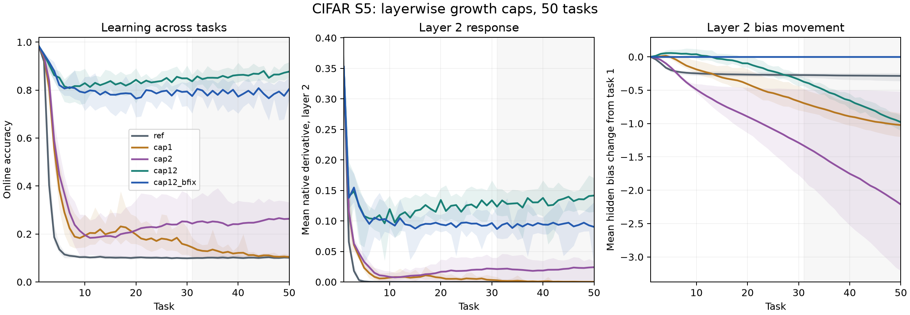

# S5結果の読み — 両層の成長制限で50タスク内の機能と応答を保持

2026-09-20 / Codex。登録主判定 **RESCUED**、自然現象の適用条件成立。主窓task31–50で、cap12のonlineは85.98%、refは10.09%。cap12は全10seedで操作的な床を上回り、機能・第2層の局所応答とも登録した対応差が正だった。初期悪影響フラグなし。ただし初回98.27%から12.30ポイント低下しており、初回能力の完全保持ではない。

spec `f524cac`、両実験の採用 `5705359`、本走実装 `318c72276690479bd816cf352874b64bba9d44a6`。S5設計と予測はS4の結果を読む前に採用。S5自身の新規R10・task1から分岐し、seed0–9、5腕、50task×30,000更新を完了。途中成績による選別・窓変更・再調整なし。17:08:59–19:52:51 JST、9,832.37秒。学習の再実行なし。

| 条件 | 登録判定 | 床seed | 主窓online | 主窓G2 |
|---|---|---:|---:|---:|
| ref | REFERENCE_FLOORED | 10/10 | 10.09% | 0.0000144 |
| cap1: W1のみ | SPLIT（副） | 4/10 | 11.91% | 0.000930 |
| cap2: W2のみ | SPLIT（副） | 1/10 | 25.10% | 0.020976 |
| cap12: W1とW2 | **RESCUED（主）** | 0/10 | **85.98%** | **0.132380** |
| cap12_bfix: 両層＋b1/b2固定 | RESCUED（副） | 0/10 | 78.85% | 0.093538 |

共通task1はonline 0.98273354、G2 0.35270345。G2はnative F.eluの局所微分を全画像・全unitで平均した量で、損失の重み勾配そのものではない。床はseedごとのラベル構成から作った登録の操作的な帯。最良の定数予測器との統計的同等性を意味しない。

cap12−refの主対応差は、online **+75.8889ポイント、97.5% CI [+75.1465,+76.6312]**、G2 **+0.132366、97.5% CI [0.126901,0.137831]**。2量をBonferroni補正した区間で、両方の下端が正。refのG2前後差95% CIは[−0.363540,−0.341838]で、10/10床と合わせて適用条件Bを満たす。

task2 onlineはref 91.92%、cap1 93.67%、cap2 94.19%、cap12 94.89%、cap12_bfix 94.91%。全介入で中点基準を下回ったseedは0/10。登録の初期悪影響フラグは全てNO_EARLY_IMPAIRMENTだった。

## 層単独とbiasの比較

cap1はrefより平均1.83ポイント高いが、主窓11.91%で4/10が床。cap2は平均15.01ポイント高く、1/10が床で個体差も大きい。両腕ともSPLITであり、cap1をCOLLAPSEDとした事前予測は外れた。単独腕を「効果なし」とは読まない。T_halfはref全seed task3、cap1 task4–5、cap2 task4–6。両単独腕の遅延符号は10/10、両側正確p=0.001953125。cap12とcap12_bfixは全seedがtask50で右打切り。

2×2交互作用はonline +0.590554（95% CI [0.529443,0.651666]）、G2 +0.110489（[0.099713,0.121265]）。登録副解析として、両層の組合せ効果は単独効果の和を上回った。この結果から、あらゆる半径・介入で両層が必要とはしない。

**bias固定の追加は改善しなかった。** cap12_bfixの主窓onlineはcap12より記述的に7.123ポイント低く、G2も0.038843低い。この直接差に新しい主検定は追加していない。cap12ではb2平均がt1→t50で−0.979094動いたまま救済され、固定腕では0だった。「残ったbias沈下が必ず救済を壊す」「bias固定を足せば良くなる」はこの走から言えない。b1/b2を同時に固定したので個別の効果は分離できない。

## 輸送帳簿と入力平均（副・REPORT_ONLY）

次表は毎タスクの4項分解を区間内で足し、unit平均→seed平均した総和。端点だけで再分解した値ではない。各seedの総和・1task当たり率・unit中央値・符号付き寄与率・誤差は[ledger_summary.csv](ledger_summary.csv)、seed平均は[ledger_mean.csv](ledger_mean.csv)。成長/方向の内訳も同ファイルに残した。

| 腕 | 窓 | 自己 | 上流 | 交差 | bias | 正味Δm2 |
|---|---|---:|---:|---:|---:|---:|
| ref | 1→10 | −108.163 | −555.297 | −111.581 | −0.248 | −775.289 |
| ref | 1→50 | −101.636 | −752.325 | −112.516 | −0.286 | −966.764 |
| ref | 30→50 | +3.730 | −62.906 | −0.395 | −0.013 | −59.584 |
| cap1 | 1→50 | −207.103 | −169.083 | −53.750 | −1.023 | −430.960 |
| cap2 | 1→50 | +294.712 | −897.805 | −93.844 | −2.214 | −699.151 |
| cap12 | 1→10 | −8.919 | +3.666 | −5.597 | +0.039 | −10.810 |
| cap12 | 1→50 | −1.050 | +19.862 | −25.849 | −0.979 | −8.016 |
| cap12 | 30→50 | +4.770 | +7.117 | −10.720 | −0.640 | +0.526 |
| cap12_bfix | 1→50 | +1.266 | +14.887 | −30.956 | 0 | −14.803 |

refのt1→t50上流−752.325の内訳は、入力平均の成長−787.890、方向+35.565。cap12では上流+19.862＝成長+5.262＋方向+14.600。後半30→50はcap12の正味平均が+0.526であり、この平均値に「沈下への寄与率」を作らない。seed別の寄与率も登録どおり、誤差から分離した正味沈下がある場合だけ定義した。

| 腕 | 平均||mu2(t1)|| | 平均||mu2(t50)|| | 平均||mu2(t50)−mu2(t1)|| |
|---|---:|---:|---:|
| ref | 52.568 | 1157.213 | 1116.120 |
| cap1 | 52.568 | 207.749 | 166.040 |
| cap2 | 52.568 | 2668.004 | 2638.402 |
| cap12 | 52.568 | 40.195 | 21.440 |
| cap12_bfix | 52.568 | 62.230 | 21.525 |

[endpoint_movement.csv](endpoint_movement.csv)に全seedを保存した。cap12はこの走で入力平均の増大と負側への大きな輸送を抑えた。帳簿は恒等式の分解であり、各項を独立に操作した因果効果ではない。

## 操作・数値検査と予測

13必須検査・43誤実装の変異検査を本走前に通過。無改変宿主とR10・2task×400epochでP/m/v/tc・乱数・onlineがbit一致。本走の同一接頭部・全ラベル・順列の対応も合格。S5 refとS4自然継続のonlineはtask1–11×10seedの110行で一致した（報告用比較）。

対象60 seed×層すべてでcapが発火し、CAP_NOT_ENGAGEDは0。cap12の行×更新発火はW1 521,754,725、W2 652,226,160。float64で測った射影後norm/r最大は全腕で1.000000179未満、登録した丸め誤差上界違反は0。bfix候補の非零書き戻し回数はb1 1,469,744,191、b2 1,465,054,239、固定後のbit誤り0。[operation_summary.csv](operation_summary.csv)に除去量・最大超過・非対象層の0も保存した。

台帳閉包の残差/許容上界の最大は0.0009395。登録端点のnative mean zと代数的W×mu+bの誤差比最大0.0094093で合格。本走全taskでも保存時に誤差上界を検査した。B16とB1200の演算形状による局所微分差は検査seedでL1最大1.57e−5、L2最大9.24e−6として開示した。

完了後の別計算で2,500行を検査し、ラベル乱数を再生成、t分位点を数値積分して床・対応区間・適用条件・腕ラベル・初期フラグを照合した。区間の最大絶対差1.10e−14、全一致（[readout_audit.json](readout_audit.json)）。これは実装者による別計算で、独立監査ではない。

Codexの登録8命題（適用条件を含む）は7的中・1不的中、binary Brier平均0.1165625。外れはcap1 COLLAPSED（確率0.65、実測SPLIT）。cap12救済、cap2 SPLIT/COLLAPSED、bfix救済、cap1遅延、cap12 b2負変化、初期悪影響なしは的中。[predictions.csv](predictions.csv)に全件を残した。Issaは予測内容を採用したが、これらの数値確率はCodexのもの。

## S4と合わせた範囲

S4はRESPONSE_BOTH_WAYS（応答復元+46.74ポイント、応答沈降−67.86ポイント）。S5は固定したt1半径で両層の重み成長に介入すると、50task内で機能と局所応答を保つ例になった。両実験は、CIFARの同じ箱で応答交換と成長制限の証拠を加える。

ただしS4は人工的な固定応答場で1task、S5は固定1200画像・ELU/std・特定半径・予算・50taskの試験。S5のcap効果が応答だけを介したことを同一網上で分離しておらず、自然な全媒介・全条件への一般化・永久的救済の証明ではない。A6のR20とS4/S5のR10も同一軌道として扱わない。

再現用入口: `analysis/cap_cifar_ee_0920/{report.py,audit_readout.py,plot_summary.py,supplement.py}`。audit/plotは結果を見る前にログ下で準備して完了後にそのまま収録、supplementは完了後の記述集計。登録判定のコード・本走のsource hashは変更していない。rawは片付け時に専用退避先へ移し、`backup_manifest.json`で解決する。
