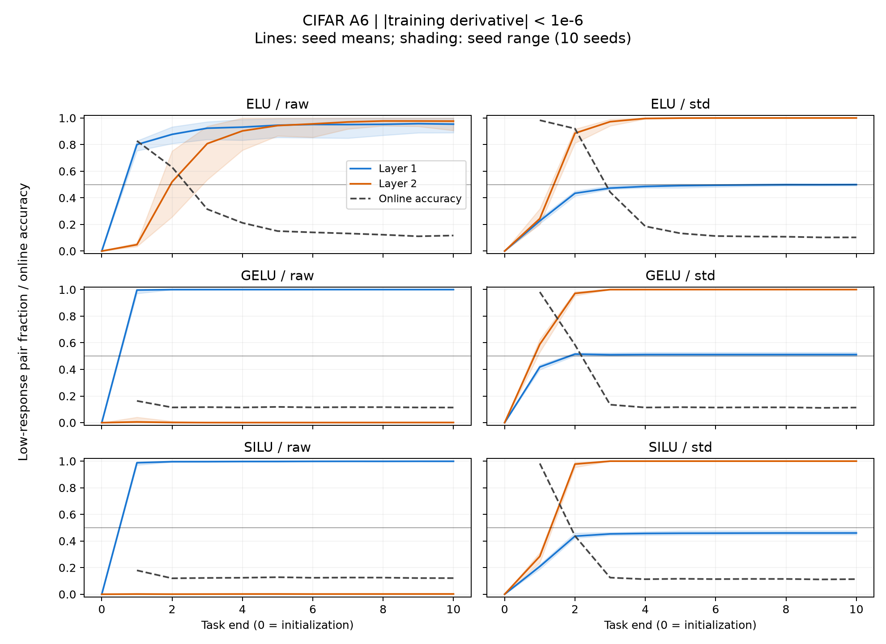

# CIFAR A6: 崩壊層と輸送帳簿

既知軌道の解析規則を事前固定した再解析。学習更新なし。独立監査未実施。
主窓は t00→T*（上限t10）。unit平均→seed別比→seed多数の順。比は符号つきで、負値・1超を許す。

| arm | cond | R1（理由つき、6/10以上） | R2 | T*中央値 | 上流比中央値 | 自己比中央値 | 交差比中央値 | bias比中央値 |
|---|---|---|---|---:|---:|---:|---:|---:|
| ELU | raw | L1_FIRST | MIXED | 1 | 0.04602 | -0.01383 | 0.9459 | 0.007179 |
| ELU | std | L2_FIRST | MIXED | 2 | 0.165 | 0.2295 | 0.5998 | 0.0002415 |
| GELU | raw | L1_FIRST | SPLIT | 1 | 0.3955 | -0.8463 | 1.469 | 0.1605 |
| GELU | std | L2_FIRST | MIXED | 1 | 0.02474 | 0.01642 | 0.9614 | -0.001195 |
| SILU | raw | L1_FIRST | SPLIT | 1 | 0.03613 | 2.367 | -1.28 | -0.04328 |
| SILU | std | L2_FIRST | MIXED | 2 | 0.1827 | 0.2009 | 0.6164 | 0.000458 |
| R | raw | INITIAL_LOW_SIMULTANEOUS | INITIAL_LOW_REPORT_ONLY | 1 | -0.0365 | 0.08472 | -0.3207 | 1.183 |
| R | std | INITIAL_LOW_SIMULTANEOUS | INITIAL_LOW_REPORT_ONLY | 1 | 0.01616 | 0.03152 | 0.9545 | -0.001225 |
| KKT1 | raw | REPORT_ONLY | REPORT_ONLY | NA | NA | NA | NA | NA |
| KKT1 | std | REPORT_ONLY | REPORT_ONLY | NA | NA | NA | NA | NA |
| LR | raw | REPORT_ONLY | REPORT_ONLY | NA | NA | NA | NA | NA |
| LR | std | REPORT_ONLY | REPORT_ONLY | NA | NA | NA | NA | NA |

比の中央値は定義可能なseedに限る。各列の定義可能数・範囲は verdict.csv、全10seedは per_seed.csv。INITIAL_LOW の比は報告のみ。中央値どうしの和に閉包は要求しない。

## 予測

| 項目 | arm/cond | 予測 | 実際 | 的中 |
|---|---|---|---|---|
| R1 | ELU/std | L2_FIRST | L2_FIRST | True |
| R1 | GELU/std | L2_FIRST | L2_FIRST | True |
| R1 | SILU/std | L2_FIRST | L2_FIRST | True |
| R1 | R/std | L2_FIRST | INITIAL_LOW_SIMULTANEOUS | False |
| R1 | GELU/raw | L1_FIRST | L1_FIRST | True |
| R1 | SILU/raw | L1_FIRST | L1_FIRST | True |
| R1 | R/raw | L1_FIRST | INITIAL_LOW_SIMULTANEOUS | False |
| R1 | ELU/raw | L1_FIRST | L1_FIRST | True |
| R2 | ELU/std | UPSTREAM_CARRIES | MIXED | False |
| R2 | GELU/std | UPSTREAM_CARRIES | MIXED | False |
| R3 | ELU/std | at_least_6_of_10 | 10 | True |
| bias | ELU/std | at_least_6_of_10 | 10 | True |

## 検査と限定

- 全306状態の再生・閉包検査: PASS。最大4項閉包誤差/上界 = 0.1856。
- 元R=20・slot順・CUDAで再生。保存z(float16)と完全一致、hist平均とCSVの登録列を照合。
- 局所微分は元phiへのautograd。診断dphiとの差は別列。dead_fracと全画像×unitの低応答率を区別。
- 初期から半数以上低応答なら INITIAL_LOW。ReLUは初期から負側微分0なので、この閾値だけでは「新たな崩壊」を識別できない場合がある。
- 同じタスク末で両層が通過した場合は SIMULTANEOUS。タスク内の先後は未測定。
- 上流/自己の寄与は端点間の代数的帰属であり、因果的媒介率ではない。S4/S5には層の候補として渡す。
- 総和とタスク当たり率、t00→t10/t50、t01→t10、t10→t50は windows.csv に REPORT_ONLY として保存。
- 判定後に閾値・窓・集約は変更していない。

## 登録した補助窓（REPORT_ONLY）

第2層、std、seed内の比の中央値。主判定の置換には使わない。

| arm | 窓 | 上流 | 自己 | 交差 | bias | 上流中の伸び |
|---|---|---:|---:|---:|---:|---:|
| ELU | t00→t10 | 72.873% | 12.816% | 14.582% | 0.029% | 103.414% |
| ELU | t01→t10 | 73.376% | 12.897% | 14.104% | 0.031% | 103.422% |
| ELU | t10→t50 | 99.413% | -0.263% | 0.488% | 0.017% | 102.332% |
| GELU | t00→t10 | 44.037% | 23.260% | 33.618% | 0.030% | 103.121% |
| GELU | t01→t10 | 45.447% | 23.920% | 31.382% | 0.036% | 103.227% |
| GELU | t10→t50 | 0.006% | 99.994% | 0.000% | 0.000% | 135.890% |
| SILU | t00→t10 | 45.659% | 20.260% | 33.762% | 0.035% | 101.449% |
| SILU | t01→t10 | 46.634% | 20.813% | 32.094% | 0.041% | 101.577% |
| SILU | t10→t50 | 36.726% | 61.486% | 0.123% | 0.005% | 104.722% |

## 読み（主判定後の整理）

- ELU/GELU/SiLUはstdで第2層、rawで第1層が先に低応答化し、各セル10/10。S4のELU/std・第2層という候補を支持する。
- ELU/stdの主窓では交差項が最大で、上流単独の過半という予測は不支持（MIXED 10/10）。交差項は同じタスク内にWとmuの両方が変わった分であり、単一の原因名ではない。
- ELU/stdは固定t00→t10では上流約73%、t10→t50では約99%。後半の輸送と初期の形成を同じ割合で語れない。主判定をUPSTREAM_CARRIESへ変更しない。
- ELU/stdの主窓で上流項の約90.7%がmuの伸び、bias絶対寄与の中央値は約0.024%。両予測は10/10で条件を満たした。
- ReLUの初期低応答・同時通過は、このQ>0.5規則では新たな故障層の先後を決められないという結果。別の閾値で読み直して登録結果を置換しない。
- Qの初回超過とonline<0.5は一致しない。例えばELU/stdの中央値は前者t2、後者t3。低応答先行層を機能的LoPそのものと呼ばない。
- S5のcap1/cap2を一方へ絞る因果根拠はA6だけでは得られない。帳簿の交差と窓依存を設計側へ渡す。

