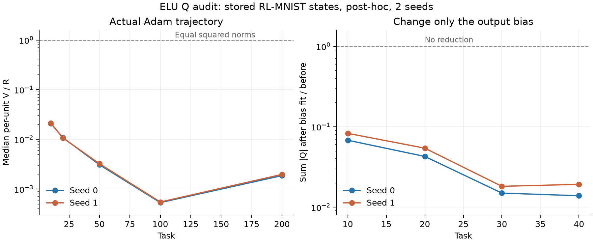

# Qは何を測るか — ELUの入力重みと読み出しの事後検証

2026-09-29 JST。新しい訓練は行わず、保存済みRL-MNIST・1層ELU・Adamの状態を解析した。Qの評価は課題10/20/30/40・切替直後/200更新後/課題末・2 seed。実際のノルム比は別の同一軌道の記録と照合して課題200まで追った。全100 unitを主集計、生存unitだけの集計も保存した。数値の正本は[summary.md](summary.md)、再現コードは`analysis/elu_q_balance_0929/analyze.py`。

**結論**: Qは任意の残差ではなく、入力側と出力側を逆向きに拡大縮小する経路の損失勾配を測る。しかし「比を1へ戻す力の補正」やAdamの実変位を閉じた形で予測する量としては使えていない。保存状態ではQの大半が、出力バイアスの未解消な平均誤差に由来する。出力バイアスだけを最適化するとQの絶対値合計は92〜99%減り、41〜56%のunitで符号が反転する。

## 1. 定義と厳密に成立する意味

隠れunit iについて u_i=(w_i,b_i)、z_in=u_i^T(x_n,1)、読み出しv_iは10クラスへのベクトル、出力のバイアスをcとする。e_n=p_n-y_n、D_in=v_i^T e_n。R_i=||u_i||^2、V_i=||v_i||^2、B_i=V_i-R_i。

同じ学習率etaのEuclidean勾配流・標準ELUで

\[
Q_i=\dot B_i=\frac{2\eta}{N}\sum_n D_{in}r(z_{in}),\qquad
r(z)=z\phi'(z)-\phi(z)=
\begin{cases}0&z>0\\1-(1-z)e^z&z\le0.\end{cases}
\]

Qの符号はrの非負性だけでは決まらない。決めるのは残差との重なりDである。表のratesはeta=1で表示し、実際の訓練学習率.001と区別した。

unit iだけに、入力側と出力側のノルムの積を保つ操作

\[
v_i(s)=e^s v_i,\quad u_i(s)=e^{-s}u_i
\]

を行い、他のparameterを固定すると

\[
\left.\frac{dL}{ds}\right|_0
=\frac1N\sum_nD_{in}[\phi(z_{in})-z_{in}\phi'(z_{in})]
=-\frac{Q_i}{2\eta}.
\]

従ってQ>0なら、局所的にはvを増やしuを縮める側で損失が下がる。Q<0ならその逆。この意味は具体的な操作に対応する。leakyではphi=z phi'なので全ての状態で0。ELUで0でないのは正の一次同次性が破れるためである。これは**この操作の損失勾配**であり、自然な更新がこの方向に沿って動く、比1が最適である、という主張ではない。

検算: ELU/LR・各2 seed・4課題の課題末で、s=±1e-4と±1e-5の有限差分を照合。ELUの相対L1誤差の最大は6.95e-8、LRの有限差分絶対誤差は1.11e-11以下。独立にSv-Sr-Qも8.88e-16以下。**後付けの記号にすぎないという疑いには、この操作的意味が答えになる。**

## 2. Qには出力バイアスの勾配が大きく混ざる

深い負側では出力が-v_iになるので、上の操作は多数入力に共通の出力ずれも作る。それを除く別の操作として

\[
c(s)=c+(e^s-1)v_i
\]

も加えると、深い負側の出力は保たれる。この経路の損失勾配に対応する量は

\[
Q_i^{\rm comp}=Q_i-2\eta v_i^T\bar e,\qquad
\bar e=\frac1N\sum_n e_n=\nabla_cL.
\]

つまり

\[
Q_i=\underbrace{2\eta v_i^T\nabla_cL}_{\text{出力バイアスの勾配との重なり}}+Q_i^{\rm comp}.
\]

補償後の経路についても有限差分を照合済み。Qcompは唯一の正しいQへの置き換えではなく、**共通の出力ずれを補償する別のparameter経路**である。元のEuclidean勾配流ではBdot=Qのまま。

課題末・各seedの4課題×100 unitで:

| 量 | seed 0 | seed 1 |
|---|---:|---:|
| Q>0の割合 | 48.0% | 45.25% |
| Qと2eta v^T mean(e)の符号一致 | 99.25% | 97.25% |
| sum|Qcomp| / sum|Q| | 4.43% | 4.48% |
| QとQcompの符号一致 | 33.75% | 40.0% |

ここで4.4%は差のL1比であり、因果媒介率・分散説明率ではない。「正側が両方を育て、負側がvの成長を打ち消す」という説明をQの符号だけから採用する根拠はない。負側の寄与も半数近くで逆符号である。

さらにw,vを固定し、出力バイアスcだけを全データのCEに対して最適化した。8状態のsum|Q|は元の1.39〜8.28%に下がり、符号は41〜56%で反転。隠れ層のz、上端、R、V、比V/Rはいずれも固定された操作である。**同じw,vの配置でも、他のparameterが平均誤差を解消するだけでQは大きく変わる。QはR,Vだけで閉じた力ではない。**

最適化後はQが負のunitが約7割になるが、この局所診断を自然なAdamの時間発展や漸近値の証明に読み替えない。出力バイアスの最適化でe自体も変わるので、最適化後のQと最適化前のQcompも同一ではない。

## 3. 実際のAdamでは比はどう動いたか

R=||w||^2+b^2、V=||v||^2。各時刻・全100 unitの**個体別V/Rの中央値**。中央値Vを中央値Rで割った値ではない。

| 課題 | seed 0 | seed 1 |
|---|---:|---:|
| 10 | 0.02100 | 0.02129 |
| 50 | 0.003085 | 0.003239 |
| 100 | 0.0005337 | 0.0005479 |
| 200 | 0.001864 | 0.001970 |

Rの中央値は課題10の約123〜127から200の約2250〜2261へ増える。Vは約2.6から課題100の約0.60へ減り、200で約4.2〜4.4へ増える。上端は約8から35〜38へ上がる。**この有限の観測窓では、比は一度下がり、後半に戻るが、1へ単調接近していない。** 将来1へ行かないという漸近的な反証ではない。

課題10→20、20→30、30→40の各10課題区間では、2 seed×100 unit×3区間の600件全てでRが増え、V/Rが下がった。一方、区間冒頭のEuclidean qdotの符号は将来の差と約48〜49%しか一致しない。Qの符号と将来のBの差も約53〜55%。**これは異なるoptimizer・瞬間勾配対10課題積分の比較であり、Qの恒等式への反証ではない。少なくともendpointのQをそのまま次の比の予測に使う根拠にはならない。**

## 4. この分解を何に使うか

- 使える: 正の一次同次性の破れを測る、指定した拡大縮小操作の損失勾配を測る、出力バイアス経路への依存を露出する。
- この監査では使えていない: 比1を固定点とする理論、ELU/Adamの比の成長率、崩壊時刻や上端の定量予測。
- Adamの実変位を説明するには、実際のdelta_u,delta_vとmoment履歴が必要。1歩の恒等式はdelta_B=2v dot delta_v-2u dot delta_u+||delta_v||^2-||delta_u||^2。横向きの更新でも二次項でノルムは増えるので、「vへの更新が横向きだからvは育たない」もそれだけでは十分な説明にならない。

**会話中の読みの修正**: 「ELUにも1へ戻す力が残る」は未確認。「Qに意味がない」も言い過ぎ。確認できた意味は**特定の尺度変更の損失勾配**であり、今回の状態ではその大半が**出力バイアスの平均誤差を読み出しが引き受ける経路**を測っていた。

## 5. 再現性と限界

`provenance.json`に入力8ファイルのパス、bytes、SHA256、解析commitを記録。`join_checks.json`は、anchor記録とノルム記録の前活性が課題10/30の3局面でbit一致すること、長期の200課題全ての上端/標準偏差/開いた入力数が一致すること、読み出しノルムも保存丸め精度で一致することを確認する。

課題末の確率はD=e W2と保存W2から復元した。Dの復元誤差は最大約1.02e-7、W2の条件数は最大6.39。float32の丸めによる微小な負確率をclip・再正規化した後もD誤差は約1.01e-7以内。bias最適化後の平均誤差は1e-11未満。元の全parameterやAdam momentは保存されていないため、Adamの1歩そのものは再現していない。

数学的なELUの微分を使っている。元のfloat32 expm1経路の深部には厳密な微分0の床がある。ここでのQは診断用のEuclidean勾配流に関する量であり、実訓練の微分・Adamの1歩と同一視しない。2 seed・特定の箱の事後解析で、独立unitを標本とみなす推測統計は行っていない。
