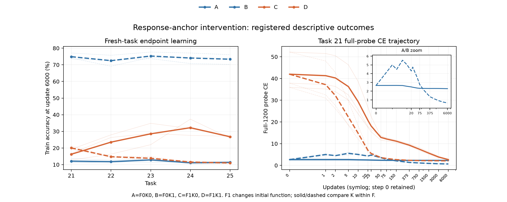

# 初期出力を揃えたELU応答回復：結果 0913

2026-09-13。事前登録した18継続走（6条件×3seed、各5課題）を完了。実装補助・集計・独立監査はユーザー指定のGPT-5.6 Sol、設計と解釈は主担当Codex。

**初期の特徴・予測・重み・Adam履歴を揃えたうえで、自然に深く沈んだ20個体の応答を変えると、新しいランダムラベルを学ぶ能力が大きく戻った。今回の主判定は `DIRECTIONAL_RESPONSE_SUPPORT`。** 「今は貢献していないから、学習余力も失われていない」とする読みを支持しない結果である。ただし、以下の固定補正を持つ人工的な応答介入の効果として解釈する。

## 何を切り分けたか

以前のbias救済は、持ち上げた瞬間に特徴と予測も変わった。今回は「最初に出す値」と「その後、重みが変わったときの反応」を分けた。元のRL・ELU1・task20終了状態、同じ対象20個体、同じ変位deltaを使い、全条件で元のパラメータとAdamのm/v/tをコピーした。選定に使ったのはtask16–20の情報だけである。

| 条件 | 開始時の特徴 | 重み変化に対する応答 |
|---|---|---|
| A | 元のまま | 元のELU |
| B | 元のまま | 浅い位置のELU応答 |
| C | 持ち上げた特徴 | 元のELU応答 |
| D | 持ち上げた特徴 | 浅い位置のELU応答（一度の通常bias救済に対応） |
| AF / BF | A / Bと同じ | 第1層W1・b1の実際の値を固定 |

対象個体で用いた関数は、phiをELU、z0(x)を完全に固定した元ネットの前活性として、

`a_FK(theta,x) = phi(z_theta(x)+K*delta) - phi(z0(x)+K*delta) + phi(z0(x)+F*delta)`

である。BはF=0,K=1なので、開始時には補正項が打ち消し合い、Aと同じ特徴を出す。その後の学習には、この関数の正しい微分を使う。deltaと補正は5課題を通して固定し、将来のラベルは使わない。補正を維持するため元ネット由来の固定特徴を利用しており、通常のELUとは異なる関数である。

## 登録主結果

主指標はtask21の**全6,000更新それぞれの更新前ミニバッチCEの平均**。A−Bが正なら改善。全3seedで0.01超なら支持、と結果を見る前に登録した。

| seed | Aの平均CE | Bの平均CE | 改善 A−B |
|---:|---:|---:|---:|
| 0 | 2.318781 | 0.992598 | 1.326183 |
| 1 | 2.295867 | 0.878437 | 1.417429 |
| 2 | 2.313137 | 0.952278 | 1.360859 |

平均改善1.368157、seedを標本単位としたt95%区間[1.253740, 1.482574]。登録判定は **DIRECTIONAL_RESPONSE_SUPPORT**。3seedの方向確認用pilotであり、課題数や個体数を独立標本数に足していない。

以下は登録副次指標。各新課題で6,000更新した後、学習に使った固定MNIST1,200枚への正解率を3seed平均した。**新しいランダム割当を覚える能力の測定であり、未知画像への汎化精度ではない。**

| 条件 | task21 | task22 | task23 | task24 | task25 |
|---|---:|---:|---:|---:|---:|
| A 元のELU | 12.111% | 11.778% | 12.833% | 11.111% | 11.361% |
| B 初期特徴を保って応答回復 | 74.889% | 72.500% | 75.278% | 74.083% | 73.361% |
| C 特徴を変え、応答は元のまま | 16.250% | 23.528% | 28.528% | 32.194% | 26.750% |
| D 一度の通常救済 | 20.056% | 14.750% | 13.833% | 11.556% | 11.000% |
| AF 第1層固定・元のELU | 11.750% | 11.556% | 12.306% | 11.278% | 11.556% |
| BF 第1層固定・応答回復 | 35.639% | 36.056% | 36.333% | 34.444% | 33.944% |

第1層を固定しても、task21の平均オンラインCEはAF−BF=0.311375改善した。上流の学習だけで全部を説明する読みとは合わない。ただしBFも第2層と出力層を学習する。全層学習との差から上流の媒介割合は算出しない。

C−Dの平均オンラインCE差は2.628363で、特徴を持ち上げた側でも応答変更の利益があった。一方、Cは後続課題でAより高い到達精度を示す。特徴の効果も存在し、応答だけの一因に還元する結果ではない。Fを変える比較は初期予測が異なる。

**初期出力の差を消しても、最初の75更新はBのほうが悪化した。** この窓の平均オンラインCEはA−B=−2.358434。改善は全6,000更新と到達点に現れる。「最初から一歩ごとに改善した」という結果ではない。登録副次の15点full-probe CE面積でもA−B=1.389541と方向が一致した。

## 個体に起きたこと

qは、その個体の**実際の応答引数 z2+K*delta**でphi'<0.05となる入力割合。q>=0.95を沈降個体と数える。全20個体の平均qと、個体の数は区別する。

| 条件 | task21終点の沈降数 /20 | task25終点の沈降数 /20 | task21の補正後活性SD | task25の補正後活性SD |
|---|---:|---:|---:|---:|
| A | 20 | 20 | 0.03369 | 0.03534 |
| B | 0 | 0 | 2.91931 | 5.90078 |
| D | 8.67 | 20 | 3.98855 | 0.34210 |

数は3seed平均、活性SDは各個体で1,200入力にわたるSDを取り対象20個体・seedで平均した値。Bは全3seed、全5課題の終点で0/20だった。Bの平均qはtask21の0.443917からtask25の0.504722へ上がるが、個体全体がほぼ無応答になる登録閾値には到達していない。これは観測窓の結果であり、永久に再沈降しないという主張ではない。

task21開始時の対象W2行ノルムはA/Bとも4.16621。終点ではA=4.16921、B=4.40136で、BはWを縮めなくても改善した。実際の3000→6000更新区間のW2行変位ノルムはA=0.01397、B=0.33892。局所微分だけでなく実際のパラメータ更新と補正後特徴の変化も出ている。ただし、入力別のzの動きは共有パラメータと上流に依存するため、微分からその方向を直結させない。

固定補正は再飽和後にも入力依存の特徴を残し得る。この点は実行前の解釈メモに記録済み。今回Bは終点で登録基準上の再飽和を示さなかったので、「再飽和した後、残った固定特徴だけで読出しが学んだ」という経路だけで観測全体を説明する必要はない。ただし固定補正の寄与率をゼロと示したわけでもない。

## どこまで言えるか

このRLチェックポイントでは、自然に沈んだ個体の応答を変更することで、初期予測を変えずに使える学習能力が大幅に増えた。**「失われていた学習余力がある」という仮説への強い介入的支持**と読む。低い性能や沈降個体数が既に頭打ちでも、この能力差は存在する。

ここで特定したのは固定補正を含む応答関数変更の総効果である。導関数だけでなく曲率・将来の特徴・飽和軌道も変わる。通常ELUのまま沈降だけを除いた自然な反実仮想、自然なLoPに占める沈降の割合、過去のどの段階で能力を失ったかは特定していない。RLで既知の崩壊点を選んだ3seed・5課題の結果であり、PMや他のネットワークへの一般化も未検証。

また、W増大と沈降は同じ因果経路の前後に位置し得る。開始時のWは完全に同じだが、その後のWは固定していない。したがって、この結果でW増大の害が消えたとは言えない。

以前の一度のbias救済の6点CE面積による **INCONCLUSIVEはそのまま残す**。今回は別の介入Bと、結果を見る前に登録した毎更新CEの主指標を用いた追試である。旧33モデルと新18モデルの演算形状も異なり、Dの長期軌道が旧救済とビット単位で一致するとは扱わない。

## 検証と再現用の所在

全実装・事前QAをcommit/push後に一度だけ本走を開始し、18本×5課題、1,350全入力probe行、オンライン配列[5,18,6000]を保存した。元のW/m/v/t・乱数継続、正しい微分、graph/eager一致、実際のW1固定、全配列の有限性はPASS。開始時の全1,200入力でA/Bの特徴・logit差は0。最初の16枚バッチでは演算丸め差が最大1.0681e−4あり、事前許容値atol2e−4+rtol1e−6内だった。

独立監査は実験エンジン・実行器・集計器をimportせず、全6,000損失から主結果を完全一致で再計算した。25保存状態の勾配・Adam診断の最大差4.77e−7、各課題のstep0→1再生の最大差1.19e−7。AF/BFのW1/b1固定誤差、初期状態差、課題境界連続性、最終checkpoint差はいずれも0。最終Adam t=150000。

- 正式登録: `specs/spec_elu_response_anchor_0913.md`、commit `c4965d09c16534ceec23e074c11171404f8840ee`。
- 実行前の補正項の解釈: `specs/notes_elu_response_anchor_0913.md`、commit `8f427ec`。
- 本走開始commit: `372cd4b85634761d709f3cafbddd79447c5069fc`。
- リポジトリ: `https://github.com/Issan0511/lop_analysis`、branch `codex/elu-response-anchor-0913`。
- SSH作業tree: `/home/issan/Projects/claude/elu_response_anchor_0913`。
- 実行器: `src/elu_response_anchor_0913.py`、SHA256 `ccda2f500db44c94f03c5d48f9c4a0e7abadb47eb8a818e19819465a3347db08`。
- 結果: `results/elu_response_anchor_0913/summary.md`, `verdict.csv`, `seed_endpoints.csv`, `selected_unit_summary.csv`, `selected_unit_summary.md`。
- 主指標の出所: `verdict.csv` の `online_ce_task21 / A_minus_B`。早期窓は `online_ce_first75_task21 / A_minus_B`。個体結果は `selected_unit_summary.csv` の `population=selected20`、各task・step=6000。W変位はstep=6000の登録直前probe3000からの区間。
- 監査: `validation.json`, `independent_audit.json`, `independent_primary.csv`, `independent_review.md`。
- 旧source: `/home/issan/Projects/claude/elu_sunk_rescue_0913/results/elu_sunk_rescue_0913/prefix/checkpoint_20.pt`。SHA256 `4b62bad9ad48a8940d81e9d709c4d987abc74eb2dec7d0b563cbad19f4d2f0c9`。
- 新raw: 上記結果ディレクトリの `anchor_cache.pt`, `learning.npz`, `units.npz`, `checkpoint.pt`, `replay/*.pt`。`learning.npz` SHA256 `be8c1feb08429f67c7e1fa6eb952edadee6342f4442abfe89f4e252856fbe21d`。
- raw別置き: `/home/issan/Projects/obsidian-research-data/elu_response_anchor_0913/files/`。29ファイル、1,998,355,361 bytes、全SHA照合済み。同一ホスト内の別ディレクトリであり、独立機へのbackupではない。
- manifest: 結果の `raw_manifest.json` と別置きrootの `manifest.json`。rawの `.pt/.npz` はGitに含まれない。

追加の学習走は実行していない。今後さらに自然な沈降の寄与を詰めるなら、固定補正を持たない機構への移植や、崩壊前後を揃えた比較は別specの課題となる。
