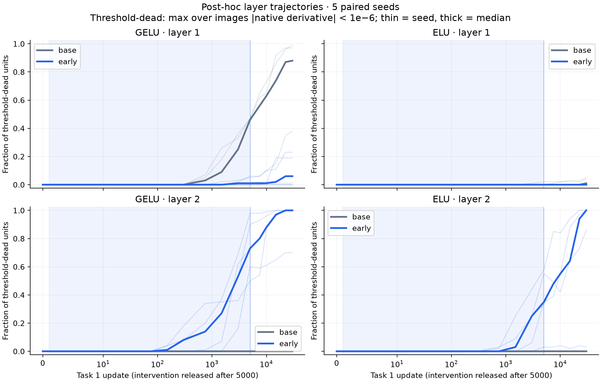

# erosion_race_0919 — 層ごとの応答と失敗経路（事後解析）

**登録結果を見た後の補助解析。C1–C4・M1–M3・P1–P7の登録判定と採点は変更しない。**

C1の救済基準は不成立だった。ただし、介入が第1層の応答を残したまま第2層が閾値死亡する走があり、失敗を単に『5000更新の猶予が短かった』と説明するのは不十分である。

ここで死亡は、1200画像での実活性化の微分についてmax|φ′|<10⁻⁶という閾値。厳密なゼロ勾配ではない。ELUにはnative exp(z)を使用しており、実験用の微分床は加えていない。

## 課題1末：機能と両層

| 腕 | acc中央値 | L1死亡unit中央値 | L2死亡unit中央値 | 全100unitが閾値死亡 L1/L2 | V1中央値 | V2中央値 |
|---|---:|---:|---:|---:|---:|---:|
| R_base | 0.114167 | 99/100 | 50/100 | 1/5・0/5 | 0 | 0.0739662 |
| GELU_base | 0.1225 | 88/100 | 0/100 | 0/5・0/5 | 0 | 2.41954 |
| ELU_base | 0.991667 | 1/100 | 0/100 | 0/5・0/5 | 0.339785 | 42.3181 |
| LR_base | 1 | 0/100 | 0/100 | 0/5・0/5 | 46.5663 | 185.87 |
| LK001_base | 0.996667 | 0/100 | 0/100 | 0/5・0/5 | 7.56289 | 95.9334 |
| SNA_base | 1 | 0/100 | 0/100 | 0/5・0/5 | 63.4645 | 119.814 |
| GELU_early | 0.111667 | 6/100 | 100/100 | 0/5・4/5 | 59.6099 | 0 |
| GELU_late | 0.113333 | 61/100 | 97/100 | 0/5・1/5 | 0 | 0 |
| ELU_early | 0.106667 | 0/100 | 100/100 | 0/5・3/5 | 115.119 | 0 |

## 介入の解除時・課題1末・課題2末

全9腕・全5seedを集約。pposは画像×unitの正側割合、zmeanはunitごとの平均前活性の下側中央値、Vはunitごとの活性sd比の下側中央値。下表ではさらにseed中央値を取る。全seed値はinterpretation.jsonに保存。

| 腕 | 課題/step | 層 | 死亡unit中央値 | 全死亡seed | ppos | zmean | V |
|---|---|---:|---:|---:|---:|---:|---:|
| R_base | 1/5000 | 1 | 99/100 | 1/5 | 0.003275 | -7.36836 | 0 |
| R_base | 1/5000 | 2 | 50/100 | 0/5 | 0.26 | -0.0414753 | 0.563737 |
| R_base | 1/30000 | 1 | 99/100 | 1/5 | 1.66667e-05 | -7.36836 | 0 |
| R_base | 1/30000 | 2 | 50/100 | 0/5 | 0.28 | -0.0354246 | 0.0739662 |
| R_base | 2/30000 | 1 | 100/100 | 5/5 | 0 | -7.36836 | 0 |
| R_base | 2/30000 | 2 | 83/100 | 1/5 | 0.17 | -0.037129 | 0 |
| GELU_base | 1/5000 | 1 | 46/100 | 0/5 | 0.00106667 | -24.5112 | 2.77282e-07 |
| GELU_base | 1/5000 | 2 | 0/100 | 0/5 | 0.439267 | -0.0126302 | 4.05391 |
| GELU_base | 1/30000 | 1 | 88/100 | 0/5 | 0.000125 | -40.2614 | 0 |
| GELU_base | 1/30000 | 2 | 0/100 | 0/5 | 0.5799 | -0.0054128 | 2.41954 |
| GELU_base | 2/30000 | 1 | 98/100 | 1/5 | 2.5e-05 | -42.5953 | 0 |
| GELU_base | 2/30000 | 2 | 0/100 | 0/5 | 0.619133 | 0.000145762 | 1.98936 |
| ELU_base | 1/5000 | 1 | 0/100 | 0/5 | 0.0621417 | -21.6225 | 0.0506154 |
| ELU_base | 1/5000 | 2 | 0/100 | 0/5 | 0.348425 | -0.476993 | 18.0057 |
| ELU_base | 1/30000 | 1 | 1/100 | 0/5 | 0.071525 | -44.0115 | 0.339785 |
| ELU_base | 1/30000 | 2 | 0/100 | 0/5 | 0.288883 | -2.85612 | 42.3181 |
| ELU_base | 2/30000 | 1 | 7/100 | 0/5 | 0.0454417 | -65.7461 | 0.000383632 |
| ELU_base | 2/30000 | 2 | 0/100 | 0/5 | 0.15295 | -11.1217 | 53.4275 |
| LR_base | 1/5000 | 1 | 0/100 | 0/5 | 0.175608 | -7.65187 | 25.3897 |
| LR_base | 1/5000 | 2 | 0/100 | 0/5 | 0.323708 | -1.18519 | 72.9027 |
| LR_base | 1/30000 | 1 | 0/100 | 0/5 | 0.269967 | -5.97721 | 46.5663 |
| LR_base | 1/30000 | 2 | 0/100 | 0/5 | 0.433075 | -1.12524 | 185.87 |
| LR_base | 2/30000 | 1 | 0/100 | 0/5 | 0.123725 | -18.1274 | 42.8197 |
| LR_base | 2/30000 | 2 | 0/100 | 0/5 | 0.18885 | -9.20579 | 171.007 |
| LK001_base | 1/5000 | 1 | 0/100 | 0/5 | 0.0210833 | -24.9954 | 2.15838 |
| LK001_base | 1/5000 | 2 | 0/100 | 0/5 | 0.2908 | -0.707762 | 27.7783 |
| LK001_base | 1/30000 | 1 | 0/100 | 0/5 | 0.0439917 | -42.5741 | 7.56289 |
| LK001_base | 1/30000 | 2 | 0/100 | 0/5 | 0.345767 | -2.2363 | 95.9334 |
| LK001_base | 2/30000 | 1 | 0/100 | 0/5 | 0.00364167 | -47.9092 | 5.86217 |
| LK001_base | 2/30000 | 2 | 0/100 | 0/5 | 0.1947 | -6.01949 | 48.3848 |
| SNA_base | 1/5000 | 1 | 0/100 | 0/5 | 0.337767 | -3.17043 | 33.5318 |
| SNA_base | 1/5000 | 2 | 0/100 | 0/5 | 0.38835 | -1.6146 | 43.8011 |
| SNA_base | 1/30000 | 1 | 0/100 | 0/5 | 0.373742 | -3.44882 | 63.4645 |
| SNA_base | 1/30000 | 2 | 0/100 | 0/5 | 0.388275 | -3.4657 | 119.814 |
| SNA_base | 2/30000 | 1 | 0/100 | 0/5 | 0.431225 | -2.46826 | 74.3813 |
| SNA_base | 2/30000 | 2 | 0/100 | 0/5 | 0.243008 | -14.3983 | 188.054 |
| GELU_early | 1/5000 | 1 | 1/100 | 0/5 | 0.599958 | 56.9028 | 168.745 |
| GELU_early | 1/5000 | 2 | 73/100 | 0/5 | 0 | -54.8013 | 0 |
| GELU_early | 1/30000 | 1 | 6/100 | 0/5 | 0.521958 | 14.2925 | 59.6099 |
| GELU_early | 1/30000 | 2 | 100/100 | 4/5 | 0 | -66.34 | 0 |
| GELU_early | 2/30000 | 1 | 10/100 | 0/5 | 0.4906 | -5.10396 | 9.29327 |
| GELU_early | 2/30000 | 2 | 100/100 | 5/5 | 0 | -80.7055 | 0 |
| GELU_late | 1/5000 | 1 | 46/100 | 0/5 | 0.00106667 | -24.5112 | 2.77282e-07 |
| GELU_late | 1/5000 | 2 | 0/100 | 0/5 | 0.439267 | -0.0126302 | 4.05391 |
| GELU_late | 1/30000 | 1 | 61/100 | 0/5 | 0.0748083 | -29.8206 | 0 |
| GELU_late | 1/30000 | 2 | 97/100 | 1/5 | 4.16667e-05 | -64.607 | 0 |
| GELU_late | 2/30000 | 1 | 87/100 | 0/5 | 0.0797667 | -32.7003 | 0 |
| GELU_late | 2/30000 | 2 | 100/100 | 3/5 | 0 | -79.1072 | 0 |
| ELU_early | 1/5000 | 1 | 0/100 | 0/5 | 0.930017 | 75.1904 | 166.017 |
| ELU_early | 1/5000 | 2 | 35/100 | 0/5 | 0 | -88.88 | 4.0367e-06 |
| ELU_early | 1/30000 | 1 | 0/100 | 0/5 | 0.660167 | 56.0626 | 115.119 |
| ELU_early | 1/30000 | 2 | 100/100 | 3/5 | 0 | -163.563 | 0 |
| ELU_early | 2/30000 | 1 | 0/100 | 0/5 | 0.599858 | 45.6085 | 105.936 |
| ELU_early | 2/30000 | 2 | 100/100 | 4/5 | 0 | -243.287 | 0 |

## 自然腕の最初750更新：下向きと上向きの両方

全6自然腕を省略せず表示。E/Rは固定最初64画像×100unitの**初期正側だった同じ対**で、実総更新の点ごとのΔzをrectifyしてから平均・積算した量。現在の正側だけを測った量でも、confidence/label成分の単純な別名でもない。σはunitの初期標準偏差。E/R/Nはseed算術平均、Vはseed中央値。

| 腕 | 平均E（下） | 平均R（上） | 平均N=E−R | V1@750 | V2@750 |
|---|---:|---:|---:|---:|---:|
| R | 79.7232 | 27.6514 | 52.0718 | 0 | 0.207244 |
| GELU | 152.285 | 74.6346 | 77.6499 | 0.0399511 | 0.818524 |
| ELU | 236.071 | 154.66 | 81.4108 | 0.14719 | 2.64193 |
| LR | 419.009 | 351.389 | 67.6196 | 4.63158 | 3.33452 |
| LK001 | 213.646 | 144.712 | 68.9334 | 0.319854 | 1.84645 |
| SNA | 560.169 | 547.869 | 12.3002 | 13.4113 | 16.8823 |

## ELU：中央値の応答低下は機能喪失と同義ではない

ELU/baseの課題1末で、全5seedの第1層sd比を提示する。q50は登録Vと同じTorchの下側中央値、q90はNumPyのlinear補間。初期sd≤10⁻⁶のunitを除外する。

| seed | 課題1末acc | 適格unit | q50（登録V） | q90（linear） |
|---|---:|---:|---:|---:|
| 1001 | 0.44 | 100 | 0.000451558 | 26.1978 |
| 1002 | 1 | 100 | 0.339785 | 33.8375 |
| 1003 | 1 | 100 | 0.0051485 | 36.1554 |
| 1004 | 0.941667 | 100 | 0.872179 | 41.4258 |
| 1005 | 0.991667 | 100 | 1.62643 | 35.226 |

seed1003はacc=1でもV=0.0051485、q90=36.1554。典型的unitの応答低下と、少数の大きな応答を持つunitの存在・高い適合が両立している。各unitの因果的な貢献は測っていない。M3の閾値到達はそのまま記録するが、『V≤.1なら学べない』とは解釈しない。

## 限定した解釈

- 初期confidence由来の負方向平均更新を抑える介入は、第1層の応答保持とネットワーク全体の適合改善を同一にはしなかった。confidenceを弱めれば常に有益、とは支持しない。
- 第1層が残り第2層が閾値死亡する経路は、層ごとの制約を含む説明を支持する。介入による特徴分散や次層入力平均の変化が候補だが、本集計はその唯一の媒介機構を証明していない。
- 第一層の共通入力平均方向の介入は画像間差も変え得る。『平均だけを動かした』純粋な操作とは読まない。
- ELUの反例は中央値だけでは機能容量を代表しきれないことを示す。少数の大きな応答、両層の状態、誤差への整合を併せて扱う必要がある。
- 2課題・5seedの事後解析であり、50課題後の維持、一般の活性化、一般の最適化に拡張しない。
