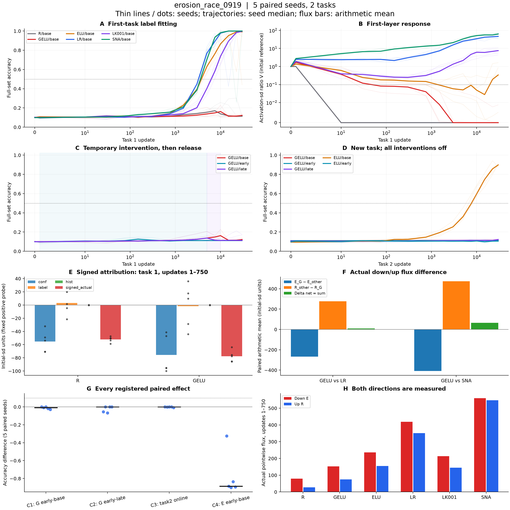

# erosion_race_0919 — 沈降と新ラベル学習の競争

登録総合判定: **5000_STEP_GRACE_NOT_SUPPORTED**。主判定C1: **NO_CLEAR_RESCUE**。

raw RL-CIFAR・2課題・各30,000更新・seed 1001–1005。第1層の初期正側probeの輸送と、新ラベルへの適合を追跡した。

判定は事前登録の中央値差≥0.10かつ4/5以上が正という記述基準。unitを独立標本にした検定ではない。

## 機能の終点

| 腕 | 課題1末acc | 課題1 online | 課題2末acc | 課題2 online |
|---|---:|---:|---:|---:|
| R/base | 0.11417 | 0.17012 | 0.11083 | 0.1065 |
| GELU/base | 0.1225 | 0.12453 | 0.11167 | 0.111 |
| ELU/base | 0.99167 | 0.81581 | 0.89833 | 0.63165 |
| LR/base | 1 | 0.86555 | 1 | 0.85136 |
| LK001/base | 0.99667 | 0.73786 | 0.92 | 0.58438 |
| SNA/base | 1 | 0.85693 | 1 | 0.93874 |
| GELU/early | 0.11167 | 0.11138 | 0.11083 | 0.11016 |
| GELU/late | 0.11333 | 0.11828 | 0.1225 | 0.11039 |
| ELU/early | 0.10667 | 0.098944 | 0.10583 | 0.098077 |

## 登録因果判定 C1–C4

early介入は課題1の1–5000更新、lateは5001–10000更新。課題末の評価は介入解除後。課題2は全腕介入なし。

| 判定 | 比較 | 読み出し | 中央値差 | 正のseed | 結果 |
|---|---|---|---:|---:|---|
| C1 | GELU/early − GELU/base | task1 acc | -0.0091667 | 0/5 | NO_CLEAR_RESCUE |
| C2 | GELU/early − GELU/late | task1 acc | -0.00083333 | 0/5 | NO_EARLY_ADVANTAGE |
| C3 | GELU/early − GELU/base | task2 online_acc | -0.00098333 | 2/5 | NO_PERSISTENT_HELP |
| C4 | ELU/early − ELU/base | task1 acc | -0.88667 | 0/5 | NO_CLEAR_ELU_RESCUE |

全seedの対応差（省略なし）:

| 判定 | seed | 左 | 右 | 左−右 |
|---|---:|---:|---:|---:|
| C1 | 1001 | 0.115 | 0.115 | 0 |
| C1 | 1002 | 0.11333 | 0.1225 | -0.0091667 |
| C1 | 1003 | 0.10667 | 0.10667 | 0 |
| C1 | 1004 | 0.1075 | 0.1275 | -0.02 |
| C1 | 1005 | 0.11167 | 0.14167 | -0.03 |
| C2 | 1001 | 0.115 | 0.17 | -0.055 |
| C2 | 1002 | 0.11333 | 0.11333 | 0 |
| C2 | 1003 | 0.10667 | 0.175 | -0.068333 |
| C2 | 1004 | 0.1075 | 0.1075 | 0 |
| C2 | 1005 | 0.11167 | 0.1125 | -0.00083333 |
| C3 | 1001 | 0.11001 | 0.111 | -0.00098333 |
| C3 | 1002 | 0.12231 | 0.12517 | -0.0028604 |
| C3 | 1003 | 0.11016 | 0.1094 | 0.00075833 |
| C3 | 1004 | 0.1065 | 0.10605 | 0.00044583 |
| C3 | 1005 | 0.11082 | 0.11838 | -0.0075604 |
| C4 | 1001 | 0.115 | 0.44 | -0.325 |
| C4 | 1002 | 0.11333 | 1 | -0.88667 |
| C4 | 1003 | 0.1 | 1 | -0.9 |
| C4 | 1004 | 0.10667 | 0.94167 | -0.835 |
| C4 | 1005 | 0.0975 | 0.99167 | -0.89417 |

ELUのC4は対照が課題1で既に高精度なら天井効果を受ける。C1不成立でも競争仮説全般の棄却とはしない。

## M1 — 符号付き寄与の起源

**CONF_NEGATIVE_DOMINANT**。課題1の更新1–750。

C/L/Hはconfidence/label/過去課題履歴の符号付き寄与。Cを一律に下向き、Lを一律に回復とは命名しない。実net=R−E。寄与単独のAdam反実仮想ではない。

| 腕 | seed | C | L | H | 実net | closure残差 | 負成分中C割合 | 基準 |
|---|---:|---:|---:|---:|---:|---:|---:|---|
| R | 1001 | -70.713 | 20.085 | 0 | -50.627 | 1.8018e-05 | 1 | 達成 |
| R | 1002 | -48.989 | 1.7126 | 0 | -47.276 | 2.0371e-05 | 1 | 達成 |
| R | 1003 | -70.611 | 20.387 | 0 | -50.224 | 2.0478e-05 | 1 | 達成 |
| R | 1004 | -32.004 | -21.486 | 0 | -53.49 | 2.0035e-05 | 0.59832 | 達成 |
| R | 1005 | -53.95 | -4.7918 | 0 | -58.742 | 2.382e-05 | 0.91843 | 達成 |
| GELU | 1001 | -99.816 | 35.847 | 0 | -63.969 | -6.886e-06 | 1 | 達成 |
| GELU | 1002 | -95.294 | 17.547 | 0 | -77.747 | -5.9832e-06 | 1 | 達成 |
| GELU | 1003 | -41.21 | -44.058 | 0 | -85.269 | -3.6256e-06 | 0.4833 | 未達 |
| GELU | 1004 | -47.036 | -28.578 | 0 | -75.614 | -6.8741e-06 | 0.62206 | 達成 |
| GELU | 1005 | -95.294 | 9.6428 | 0 | -85.651 | 5.7169e-07 | 1 | 達成 |

## M2 — 実際の下向き量と上向き量

E=Σ mean max(−Δz/σ初期,0)、R=Σ mean max(Δz/σ初期,0)。maxは実総更新へ適用する。初期正側だった同じ対を固定追跡し、現在の正側集合への出入りで母集団を変えない。

ΔN=(E_GELU−E_other)+(R_other−R_GELU)。下表の集約は**算術平均**で、二項分解の加法性を保つ。

| GELU対 | 平均ΔN | 下向き差 | 上向き差 | 判定 |
|---|---:|---:|---:|---|
| LR | 10.03 | -266.72 | 276.75 | MORE_UPWARD |
| SNA | 65.35 | -407.88 | 473.23 | MORE_UPWARD |

| 比較 | seed | E_G | E_other | R_G | R_other | ΔN | 下向き差 | 上向き差 |
|---|---:|---:|---:|---:|---:|---:|---:|---:|
| LR | 1001 | 135.94 | 387.97 | 71.97 | 329.33 | 5.3297 | -252.03 | 257.36 |
| LR | 1002 | 146.35 | 408.17 | 68.6 | 333.17 | 2.7539 | -261.82 | 264.57 |
| LR | 1003 | 166.86 | 416.03 | 81.591 | 355.73 | 24.973 | -249.17 | 274.14 |
| LR | 1004 | 149.5 | 419.91 | 73.885 | 359.63 | 15.334 | -270.41 | 285.74 |
| LR | 1005 | 162.78 | 462.97 | 77.127 | 379.08 | 1.7605 | -300.19 | 301.95 |
| SNA | 1001 | 135.94 | 515.32 | 71.97 | 503.51 | 52.166 | -379.38 | 431.54 |
| SNA | 1002 | 146.35 | 551.82 | 68.6 | 537.22 | 63.15 | -405.47 | 468.62 |
| SNA | 1003 | 166.86 | 575.35 | 81.591 | 568.74 | 78.667 | -408.49 | 487.15 |
| SNA | 1004 | 149.5 | 547.04 | 73.885 | 540.81 | 69.381 | -397.54 | 466.92 |
| SNA | 1005 | 162.78 | 611.33 | 77.127 | 589.06 | 63.385 | -448.55 | 511.93 |

## M3 — 応答低下と適合の時間順

主読み出しVは第1層: unitごとの活性sd/初期sdの中央値（初期sd≤1e−6を除く）。課題2も同じ初期基準。V≤.1とacc≥.5をそれぞれ連続2診断で確認する。

区間は最初の該当診断と直前診断の間。step0から成立は左打切り。未到達は右打切りとして観測末を記し、∞とは置かない。課題をまたいで連続2点をつなげない。第2層の副指標はverdict.jsonに保存。

| 腕 | seed | 課題 | 第1層V低下の到達区間 | 適合の到達区間 | 最初の観測順 |
|---|---:|---:|---|---|---|
| R/base | 1001 | 1 | (1, 10]; 確認30 | 未到達・右打切り(30000) | CENSORED |
| R/base | 1001 | 2 | ≤0・左打切り; 確認1 | 未到達・右打切り(30000) | CENSORED |
| R/base | 1002 | 1 | (1, 10]; 確認30 | 未到達・右打切り(30000) | CENSORED |
| R/base | 1002 | 2 | ≤0・左打切り; 確認1 | 未到達・右打切り(30000) | CENSORED |
| R/base | 1003 | 1 | (1, 10]; 確認30 | 未到達・右打切り(30000) | CENSORED |
| R/base | 1003 | 2 | ≤0・左打切り; 確認1 | 未到達・右打切り(30000) | CENSORED |
| R/base | 1004 | 1 | (1, 10]; 確認30 | 未到達・右打切り(30000) | CENSORED |
| R/base | 1004 | 2 | ≤0・左打切り; 確認1 | 未到達・右打切り(30000) | CENSORED |
| R/base | 1005 | 1 | (1, 10]; 確認30 | 未到達・右打切り(30000) | CENSORED |
| R/base | 1005 | 2 | ≤0・左打切り; 確認1 | 未到達・右打切り(30000) | CENSORED |
| GELU/base | 1001 | 1 | (10, 30]; 確認75 | 未到達・右打切り(30000) | CENSORED |
| GELU/base | 1001 | 2 | ≤0・左打切り; 確認1 | 未到達・右打切り(30000) | CENSORED |
| GELU/base | 1002 | 1 | (750, 1500]; 確認3000 | 未到達・右打切り(30000) | CENSORED |
| GELU/base | 1002 | 2 | ≤0・左打切り; 確認1 | 未到達・右打切り(30000) | CENSORED |
| GELU/base | 1003 | 1 | (30, 75]; 確認150 | 未到達・右打切り(30000) | CENSORED |
| GELU/base | 1003 | 2 | ≤0・左打切り; 確認1 | 未到達・右打切り(30000) | CENSORED |
| GELU/base | 1004 | 1 | (300, 750]; 確認1500 | 未到達・右打切り(30000) | CENSORED |
| GELU/base | 1004 | 2 | ≤0・左打切り; 確認1 | 未到達・右打切り(30000) | CENSORED |
| GELU/base | 1005 | 1 | (30, 75]; 確認150 | 未到達・右打切り(30000) | CENSORED |
| GELU/base | 1005 | 2 | ≤0・左打切り; 確認1 | 未到達・右打切り(30000) | CENSORED |
| ELU/base | 1001 | 1 | (300, 750]; 確認1500 | (3000, 5000]; 確認7500 | RESPONSE_FIRST |
| ELU/base | 1001 | 2 | ≤0・左打切り; 確認1 | (7500, 10000]; 確認15000 | RESPONSE_FIRST |
| ELU/base | 1002 | 1 | 未到達・右打切り(30000) | (3000, 5000]; 確認7500 | CENSORED |
| ELU/base | 1002 | 2 | (30, 75]; 確認150 | (7500, 10000]; 確認15000 | RESPONSE_FIRST |
| ELU/base | 1003 | 1 | (750, 1500]; 確認3000 | (3000, 5000]; 確認7500 | RESPONSE_FIRST |
| ELU/base | 1003 | 2 | ≤0・左打切り; 確認1 | (5000, 7500]; 確認10000 | RESPONSE_FIRST |
| ELU/base | 1004 | 1 | (750, 1500]; 確認3000 | (3000, 5000]; 確認7500 | RESPONSE_FIRST |
| ELU/base | 1004 | 2 | (10, 30]; 確認75 | (5000, 7500]; 確認10000 | RESPONSE_FIRST |
| ELU/base | 1005 | 1 | (5000, 7500]; 確認10000 | (3000, 5000]; 確認7500 | FIT_FIRST |
| ELU/base | 1005 | 2 | (30, 75]; 確認150 | (7500, 10000]; 確認15000 | RESPONSE_FIRST |
| LR/base | 1001 | 1 | 未到達・右打切り(30000) | (3000, 5000]; 確認7500 | CENSORED |
| LR/base | 1001 | 2 | 未到達・右打切り(30000) | (1500, 3000]; 確認5000 | CENSORED |
| LR/base | 1002 | 1 | 未到達・右打切り(30000) | (3000, 5000]; 確認7500 | CENSORED |
| LR/base | 1002 | 2 | 未到達・右打切り(30000) | (3000, 5000]; 確認7500 | CENSORED |
| LR/base | 1003 | 1 | 未到達・右打切り(30000) | (3000, 5000]; 確認7500 | CENSORED |
| LR/base | 1003 | 2 | 未到達・右打切り(30000) | (1500, 3000]; 確認5000 | CENSORED |
| LR/base | 1004 | 1 | 未到達・右打切り(30000) | (3000, 5000]; 確認7500 | CENSORED |
| LR/base | 1004 | 2 | 未到達・右打切り(30000) | (3000, 5000]; 確認7500 | CENSORED |
| LR/base | 1005 | 1 | 未到達・右打切り(30000) | (3000, 5000]; 確認7500 | CENSORED |
| LR/base | 1005 | 2 | 未到達・右打切り(30000) | (3000, 5000]; 確認7500 | CENSORED |
| LK001/base | 1001 | 1 | 未到達・右打切り(30000) | (5000, 7500]; 確認10000 | CENSORED |
| LK001/base | 1001 | 2 | 未到達・右打切り(30000) | (10000, 15000]; 確認22500 | CENSORED |
| LK001/base | 1002 | 1 | 未到達・右打切り(30000) | (5000, 7500]; 確認10000 | CENSORED |
| LK001/base | 1002 | 2 | 未到達・右打切り(30000) | (7500, 10000]; 確認15000 | CENSORED |
| LK001/base | 1003 | 1 | 未到達・右打切り(30000) | (5000, 7500]; 確認10000 | CENSORED |
| LK001/base | 1003 | 2 | 未到達・右打切り(30000) | (7500, 10000]; 確認15000 | CENSORED |
| LK001/base | 1004 | 1 | 未到達・右打切り(30000) | (5000, 7500]; 確認10000 | CENSORED |
| LK001/base | 1004 | 2 | 未到達・右打切り(30000) | (10000, 15000]; 確認22500 | CENSORED |
| LK001/base | 1005 | 1 | 未到達・右打切り(30000) | (5000, 7500]; 確認10000 | CENSORED |
| LK001/base | 1005 | 2 | 未到達・右打切り(30000) | (10000, 15000]; 確認22500 | CENSORED |
| SNA/base | 1001 | 1 | 未到達・右打切り(30000) | (3000, 5000]; 確認7500 | CENSORED |
| SNA/base | 1001 | 2 | 未到達・右打切り(30000) | (750, 1500]; 確認3000 | CENSORED |
| SNA/base | 1002 | 1 | 未到達・右打切り(30000) | (3000, 5000]; 確認7500 | CENSORED |
| SNA/base | 1002 | 2 | 未到達・右打切り(30000) | (750, 1500]; 確認3000 | CENSORED |
| SNA/base | 1003 | 1 | 未到達・右打切り(30000) | (3000, 5000]; 確認7500 | CENSORED |
| SNA/base | 1003 | 2 | 未到達・右打切り(30000) | (750, 1500]; 確認3000 | CENSORED |
| SNA/base | 1004 | 1 | 未到達・右打切り(30000) | (3000, 5000]; 確認7500 | CENSORED |
| SNA/base | 1004 | 2 | 未到達・右打切り(30000) | (750, 1500]; 確認3000 | CENSORED |
| SNA/base | 1005 | 1 | 未到達・右打切り(30000) | (3000, 5000]; 確認7500 | CENSORED |
| SNA/base | 1005 | 2 | 未到達・右打切り(30000) | (750, 1500]; 確認3000 | CENSORED |
| GELU/early | 1001 | 1 | (15000, 22500]; 確認30000 | 未到達・右打切り(30000) | CENSORED |
| GELU/early | 1001 | 2 | ≤0・左打切り; 確認1 | 未到達・右打切り(30000) | CENSORED |
| GELU/early | 1002 | 1 | 未到達・右打切り(30000) | 未到達・右打切り(30000) | CENSORED |
| GELU/early | 1002 | 2 | 未到達・右打切り(30000) | 未到達・右打切り(30000) | CENSORED |
| GELU/early | 1003 | 1 | 未到達・右打切り(30000) | 未到達・右打切り(30000) | CENSORED |
| GELU/early | 1003 | 2 | 未到達・右打切り(30000) | 未到達・右打切り(30000) | CENSORED |
| GELU/early | 1004 | 1 | 未到達・右打切り(30000) | 未到達・右打切り(30000) | CENSORED |
| GELU/early | 1004 | 2 | 未到達・右打切り(30000) | 未到達・右打切り(30000) | CENSORED |
| GELU/early | 1005 | 1 | 未到達・右打切り(30000) | 未到達・右打切り(30000) | CENSORED |
| GELU/early | 1005 | 2 | 未到達・右打切り(30000) | 未到達・右打切り(30000) | CENSORED |
| GELU/late | 1001 | 1 | (10, 30]; 確認75 | 未到達・右打切り(30000) | CENSORED |
| GELU/late | 1001 | 2 | ≤0・左打切り; 確認1 | 未到達・右打切り(30000) | CENSORED |
| GELU/late | 1002 | 1 | (750, 1500]; 確認3000 | 未到達・右打切り(30000) | CENSORED |
| GELU/late | 1002 | 2 | ≤0・左打切り; 確認1 | 未到達・右打切り(30000) | CENSORED |
| GELU/late | 1003 | 1 | (30, 75]; 確認150 | 未到達・右打切り(30000) | CENSORED |
| GELU/late | 1003 | 2 | ≤0・左打切り; 確認1 | 未到達・右打切り(30000) | CENSORED |
| GELU/late | 1004 | 1 | (300, 750]; 確認1500 | 未到達・右打切り(30000) | CENSORED |
| GELU/late | 1004 | 2 | ≤0・左打切り; 確認1 | 未到達・右打切り(30000) | CENSORED |
| GELU/late | 1005 | 1 | (30, 75]; 確認150 | 未到達・右打切り(30000) | CENSORED |
| GELU/late | 1005 | 2 | ≤0・左打切り; 確認1 | 未到達・右打切り(30000) | CENSORED |
| ELU/early | 1001 | 1 | 未到達・右打切り(30000) | 未到達・右打切り(30000) | CENSORED |
| ELU/early | 1001 | 2 | (15000, 22500]; 確認30000 | 未到達・右打切り(30000) | CENSORED |
| ELU/early | 1002 | 1 | 未到達・右打切り(30000) | 未到達・右打切り(30000) | CENSORED |
| ELU/early | 1002 | 2 | 未到達・右打切り(30000) | 未到達・右打切り(30000) | CENSORED |
| ELU/early | 1003 | 1 | 未到達・右打切り(30000) | 未到達・右打切り(30000) | CENSORED |
| ELU/early | 1003 | 2 | 未到達・右打切り(30000) | 未到達・右打切り(30000) | CENSORED |
| ELU/early | 1004 | 1 | 未到達・右打切り(30000) | 未到達・右打切り(30000) | CENSORED |
| ELU/early | 1004 | 2 | 未到達・右打切り(30000) | 未到達・右打切り(30000) | CENSORED |
| ELU/early | 1005 | 1 | 未到達・右打切り(30000) | 未到達・右打切り(30000) | CENSORED |
| ELU/early | 1005 | 2 | 未到達・右打切り(30000) | 未到達・右打切り(30000) | CENSORED |

## 事前予測の採点

| key | 事前予測 | p | 的中 |
|---|---|---:|---|
| P1 | C1 = EARLY_HELPS | 0.60 | no |
| P2 | C2 = EARLY_ADVANTAGE | 0.65 | no |
| P3 | C3 does not meet persistent-improvement criterion | 0.65 | yes |
| P4 | M1 = CONF_NEGATIVE_DOMINANT | 0.65 | yes |
| P5 | M2 GELU vs LR = LESS_DOWNWARD | 0.55 | no |
| P6 | M2 GELU vs SNA = LESS_DOWNWARD | 0.55 | no |
| P7 | task1 fit reached: ELU >= 4/5, GELU <= 1/5 | 0.80 | yes |

Codex: **3/7**, Brier **0.2389**。P7の課題1適合到達数: {'ELU': 5, 'GELU': 0}。

## 解釈の限界

- 2課題・5 seedでの固定ランダムラベル適合であり、50課題の帰結や未見画像への汎化は判定していない。
- 介入は実軌道のconfidence由来の負方向平均更新を取り除く。画像間差にも作用し得るため、平均だけの純粋な媒介操作とは主張しない。
- M1/M2のprobeは64枚の初期正側対に限定。全1200画像の厳密輸送ではない。
- M3は時間順の観測であり、単独では因果を示さない。応答閾値は微分の非ゼロ性そのものではない。

