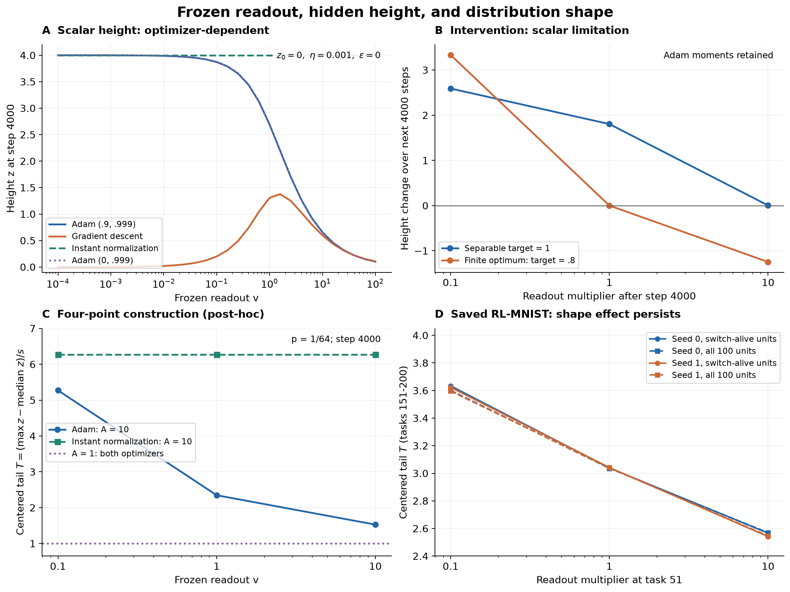

# 小さいvとELU上端：機構について何を絞れたか

2026-09-29。目的は、同じ現象の出る模型を増やすことではなく、元のELUで働く機構を理論から特定することである。

**今回の検証だけでは、第5段「小v→上端が立つ」の実機構はまだ同定できていない。** 理論と既存データから確定したのは、入力重みwの大きさの補償だけでは説明できず、入力から見えるwの方向が変わる必要があること。さらに、残差の入力別の重み付け・Adamの前処理と履歴・正負の切替・ELU負側の指数部分を区別するための式と反証条件を導いた。

単純なlogisticで現象を作れたことは、実ELUの原因の証明ではない。同じ所見が別の機構でも起こることを示すので、実機構を同定するにはさらに厳しい比較が必要になる。

## 1. スケールの補償だけ、という説明は排除できる

上端/sはバイアスの移動でも変わる。そこで、同じ入力集合上の

\[
T=\frac{\max z-\operatorname{median}z}{s}
\]

を調べた。zₙ=wᵀxₙ+b、入力共分散Σを用いると、

\[
T(w)=
\frac{\max_n w^\top x_n-\operatorname{median}_n w^\top x_n}
{\sqrt{w^\top\Sigma w}}.
\]

bが消え、wの正の一様伸縮でもTは変わらない。従って、同じunitのTが変わったなら、データの中心化した部分空間でwの方向が変わっている必要がある。これは機構の候補ではなく、幾何学的な必要条件である。Σはここでは固定入力の共分散であり、確率的な勾配雑音のcovではない。

既存vfreezeの8 NPZを独立に再集計した。task51で学習済みW2をc倍して凍結、W1とバイアスは学習を継続。入力1200枚は全taskで固定され、ラベルだけが変わる。以下はtask151–200の各taskの生存unit中央値を平均し、2seedを平均した値。

| 読み出し倍率c | 生の上端 | 上端/s | T=(上端−本体)/s | CE |
|---|---:|---:|---:|---:|
| .1 | 43.627 | 1.421 | 3.628 | 2.083 |
| 1 | 11.428 | .654 | 3.040 | 2.022 |
| 10 | 2.643 | .171 | 2.554 | 1.989 |

生死による選別をやめて同じunit・同じtaskを比較しても、c=.1のTがc=10より大きい割合はseed0で97.08%、seed1で95.70%。全体の拡大・平行移動・生存unitの入替えだけでは差を説明できない。unit-taskを独立標本とする検定はしていない。

必要なのは**wの方向差**である。凍結3腕ではvの方向は同じで固定されているため、「介入後のvの方向学習」はこの効果の必要条件ではない。一方、自由学習腕と1倍凍結腕の差はvのnormと方向を両方止めた差であり、vの方向だけの寄与を分離していない。[保存データ監査](saved_report.md)。

## 2. 実ELUの更新式から、vを変える場所を確定する

読み出し全体をa倍し、logitをfₙ=c+a hₙ、hₙ=Σᵢvᵢφ(zᵢₙ)と書く。softmax残差eₙ=pₙ−yₙなら、unit iの入力重みの勾配は

\[
g_i(a)=a\,E[\phi'(z_i)x\,v_i^\top e(a)].
\]

同じw・バイアス・同じバッチからaだけを変えた応答は、

\[
\frac{\partial g_i}{\partial a}
=E[\phi'(z_i)x\,v_i^\top e]
+aE[\phi'(z_i)x\,v_i^\top Hh],
\qquad H=\operatorname{diag}(p)-pp^\top.
\]

第一項は明示的な勾配倍率、第二項は予測が変わることで生じる**入力別・クラス別の残差の重み付けの変化**である。Hが半正定値でも交差項vᵢᵀHhの符号は決まらず、vのnormだけから更新方向を決めることはできない。

さらに、元のvfreezeは既存Adam momentsを保持する。したがって介入直後には、明示的なaも分子分母でそのまま相殺しない。既存momentと新しい勾配の混合を含む一歩の応答も厳密に導いた。式は[実系の応答理論](../../analysis/logistic_v_height_0929/actual_response_theory.md)。

この式の各項を名前で呼ぶだけでは、以前のQの分解と同じ問題が残る。必要なのは、各項がTを増やす符号をもつ条件、または同じ状態からその項だけを切ったときの予測である。

## 3. 符号まで導ける、条件つきの機構

例として、入力が中心対称・共分散Iで、現在の上端を担う入力x*が正しく分類される向きに、選択的な更新Δw=κx*、κ>0を受ける場合を考える。中央値0、上端の順位が変わらない範囲では、

\[
\frac{dT}{d\kappa}
=\frac{\|x_*\|^2-(w^\top x_*)^2/\|w\|^2}{\|w\|}
\ge0.
\]

これは、上端入力への選択的な当てはめがwをその入力へ向け、本体からの規格化された距離を伸ばす、という機構の符号を与える。

ただし、ここから「小vほどその更新が強い」とはまだ言えない。二値logisticの正marginでのSGD駆動はa r(az)、r(m)=1/(1+eᵐ)で、

\[
\frac{\partial}{\partial a}\{a r(az)\}
=r(az)\{1-az\,\sigma(az)\}.
\]

小aにすると駆動が強くなるのはaz σ(az)>1、すなわちmarginがおよそ1.278を超える側である。小margin側では反対になる。「残差が大きい」だけでは、vを掛けた後の駆動の大小は決まらない。

Adamでは更新方向がx*に沿う保証もない。対角前処理Dを含めると、上の非負式は一般に成立せず、正定値のDでもTを減らす反例がある。古いmomentや他の入力からの寄与が支配する場合も同様である。従って、元のELUについては、上端入力の残差・実際の前処理・他入力の更新との釣り合いを測らずに、この機構と断定できない。

この条件つきの導出は、どの仮定を測れば符号のある説明になるかを指定する。単に最終的な上端の形を合わせる説明とは区別する。

## 4. もう一つの理論的基準：ゲート固定・負側飽和なら形は保てる

ELUを「正側z、負側−1」と近似し、各入力の正負が変わらない範囲では、

\[
v_i'=a v_i,\quad
w_i'=w_i/a,\quad
b_i'=(b_i+1)/a-1,\quad
c'=c+(a-1)\sum_i v_i
\]

という変換でlogitを厳密に保てる。このときz'=(z+1)/a−1なのでTも変わらない。変換後にも正負が保たれることが条件で、どんなaにも適用できるわけではない。

これは対応する予測を表現できるという対称性であり、固定学習率Adamがその経路をたどるという定理ではない。それでも、単なる「小vをwで補償して当てはめる」という最適解のスケール論だけではTの変化が出ないことは明確になる。

正確なELUでは、同じ変換を施した負側に

\[
a\exp((z+1)/a-1)-\exp(z)
\]

という補正が残る。またψ=ELU+1の出力を個別にa倍と相殺する写像は、負側ではz'=z−log a、正側ではz'=(z+1)/a−1となり、一般に共通のaffine変換では実現できない。ただし各unitの出力を個別に保つことは、ネットワークの損失最小化が要求する条件ではない。この非同次性だけから観測された符号を結論してはいけない。

微小変化については、単なるaffine補償からのlogitの逸脱が、厳密に

\[
D_n=\sum_i v_i\,\kappa(z_{in}),\qquad
\kappa(z)=(-z)e^z\,\mathbf1_{z<0}
\]

となる。正側は0、深い負側で小さく、核の値はz=−1で最大1/e。z≤−8ならκ≤.002684である。ただし応答にはκの微分、unitの和、入力とreadoutの大きさ、損失の曲率も入り、この核だけで支配的な入力群を断定できない。

有限の非退化な停留点を追うという条件では、affine補償方向Sと損失Hessian Hを使って

\[
\theta^{*\,\prime}
=S-H^{-1}\nabla_\theta E[e^\top D],
\qquad
\frac{dT^*}{da}
=-\nabla_\theta T^\top H^{-1}\nabla_\theta E[e^\top D]
\]

と導ける。TはS方向では変わらないため、**この条件下で目的関数の側から形を変える項がどこにあるか**を特定している。Hが特異なら形を変えるnull方向の選択が残り、未収束のAdam軌道にはこの停留点の式を適用できない。符号もまだ決まらない。これは未知のHを置いて説明を終える式ではなく、飽和・ゲート固定という極限で消えるべき項を指定するための式である。

整理すると、候補は有限時間・初期状態・Adamの動力学による方向選択、正負の切替による制約、ELU負側の指数的な寄与である。詳細と有限最適点の条件は[分枝とスケールの理論](../../analysis/logistic_v_height_0929/branch_scale_theory.md)。

## 5. 数値検証は、上の説明をどこまで支えたか

スカラー739設定と追加長時間9設定（最大100万歩）、共有入力135条件＋線形等価性対照45条件、事後に選んだ4点模型72条件を計算した。これらは感度・反証・十分性の検査であり、独立なRL-MNIST追試の数ではない。

Aはスカラー高さ、Bは同じ状態からの途中介入、Cは事後に設計した4点模型、Dは既存RL-MNIST。CとDで似た所見が出ても、同じ機構とは言えない。[PDF](overview.pdf)。

### スカラー模型で、長い二次moment履歴の効果は特定できた

L=log(1+exp(−vz))、η=.001、z₀=0、4000歩、ε=0。

| optimizer | v=.1でのz | v=1でのz | v=10でのz |
|---|---:|---:|---:|
| Adam (.9,.999) | 3.8719 | 2.6923 | .6557 |
| 一次moment履歴なし (0,.999) | 3.8702 | 2.6846 | .6526 |
| 二次moment履歴なし (.9,0) | 4.0020 | 4.0303 | 4.4374 |
| 瞬時正規化 (0,0) | 4.0000 | 4.0000 | 4.0000 |
| GD | .1990 | 1.3066 | .5980 |

固定vでゼロmomentから開始するとAdamの一歩は厳密に

\[
\Delta z=\eta\frac{\widehat{\mathrm{EMA}}_{\beta_1}(r)}
{\sqrt{\widehat{\mathrm{EMA}}_{\beta_2}(r^2)}+\epsilon/v}.
\]

大vで残差が急速に減ると、長い二次moment履歴が分母に残って一歩を減速させる。一次履歴を除いても効果が残り、二次履歴を除くとこの順序がなくなる。**これは当該スカラー模型内の機構であり、元のELUの機構の同定ではない。**

GDの厳密勾配流ではm=vzに対してm+eᵐ=1+ηv²t。固定時刻ではv→0でz→0となるので、「小vほど高い」はlogisticの一般法則ではない。Adamでも固定ε>0でv→0とすると一歩は小さくなる。

同じ損失ならz=m/vという逆比例は厳密だが、同じ4000歩での損失はv=.1/1/10で.518/.0655/.00142と異なる。この比較を同じ損失を達成する補償と説明してはいけない。

また分離可能なスカラー模型は常にzを増やす。vを途中で10倍にしても上端は下がらず、z=2.692から4000歩後に2.697となった。実ELUの上端下降への介入応答を説明できていない。soft target π=.8にして有限最適margin log4を与えれば下降は作れるが、一変数のためTは変わらない。[詳細](scalar_summary.md)、[長時間と極限の理論](../../analysis/logistic_v_height_0929/theory.md)。

### 異方的4点模型は、方向変化を起こせる十分性の例

入力±A e₁、±e₂、前者の総質量p、ラベルは非零成分の符号とすると、

\[
L=p\log(1+e^{-vAw_1})+(1-p)\log(1+e^{-vw_2}).
\]

ε=0では正の損失重みは各座標のAdamで相殺され、gain=vAとvのスカラー模型に分離する。両方向の残差とmoment履歴の差がw₁/w₂を変える。h₁=Aw₁≥h₂=w₂、R=h₁/h₂ならT=R/√(pR²+1−p)、dT/dR>0。

A=10、p=1/64、4000歩：

| v | h₁ | h₂ | R | T |
|---|---:|---:|---:|---:|
| .1 | 26.923 | 3.872 | 6.953 | 5.272 |
| 1 | 6.557 | 2.692 | 2.435 | 2.347 |
| 10 | 1.012 | .656 | 1.544 | 1.528 |

瞬時正規化では全vでw₁=w₂=4、T=6.266。A=1ならAdamでもT=1。理論から対照の結果を予測できる。ただしAdamの座標軸に入力方向を揃えた特殊な構成であり、入力間競合もない。両座標が増える一方で、途中の上端下降は出ず、p⁺も.5のまま。事後に選んだこの例は、元のELUの原因を絞る証拠には数えない。[導出](anisotropic_report.md)、[方向別の更新](anisotropic_dynamics.png)。

### 共有入力の検証では、規格化上端の符号は揃わなかった

同じGaussian由来128入力、5seed、線形・ELU1unit・ELU8unit、均衡分離ラベル・稀な正ラベル・ランダムラベルを調べた。9条件×5seedの45組すべてで小vの生の上端が高かったが、Tまで高かったのは18/45組。例えばELU1unit・均衡ラベルの5seed平均：

| v倍率 | 生の上端 | T |
|---|---:|---:|
| .1 | 17.412 | 2.274 |
| 1 | 9.867 | 2.408 |
| 10 | 3.240 | 2.551 |

絶対高さと分布形を同じ機構で説明できるとは限らない。線形logisticはθ=vwへ変換すると、学習率ηv・epsilon ε/vのAdamと厳密対応する。無正則化・有限で一意な最適予測という条件ではzは一様な1/v倍となり、Tは一致する。有限時間の差を、平衡形の差とは扱わない。[全条件](shared_report.md)、[図](shared_shapes.png)。

## 6. 実機構の同定に足りないもの

既存NPZにはW1、入力ごとのz・残差、Adam moments、上端入力のIDがなく、保存統計だけからは上の符号条件を評価できない。この不足を補うため、元のデータと実装の設定でtask50状態を再構成し、そこから同一状態の短期介入を追加した。これは別の模型で終端の形を合わせる作業とは異なる。

実機構を区別する介入は、実行前の[識別性の検討](../../analysis/logistic_v_height_0929/mechanism_identifiability.md)にまとめた。元の系と同じ状態から、残差とmomentの明示的な倍率効果を区別し、Tを伸ばす実際の更新への寄与を比較する。task51–53の結果を追加し、元の長期効果の同定とは区別する。

最大・中央値の順位が局所的に固定なら、

\[
\Delta T\simeq
\left(\frac{x_{\max}-x_{\mathrm{med}}}{s}
-\frac{T\Sigma w}{s^2}\right)^\top\Delta w.
\]

この射影はwに平行な成長を一次で除く。しかしこの内積を未知量のまま置くことは説明の完成ではない。条件つき符号予測や介入結果をこの式で検査するのが用途である。順位変更時は更新後のTも直接比較する。

## 7. 精度と再現性

- スカラー：独立PyTorchとの最大差3.08e−13。GDの刻み半減で厳密流との誤差が約半分。
- 共有入力：autograd勾配との差1.12e−15、Adam32歩のparameter差4.86e−17。random-label線形・大gainの2seedでは停留点付近で丸め差が増幅したことも記録。全軌道logit差最大.01459、最終Tへの影響最大1.59e−5。全条件で丸め誤差程度に一致したとはしていない。
- 4点模型：独立PyTorchとの差1.55e−13、損失重みに伴うε換算の差2.23e−15。
- 実ELUの同一状態でのreadout応答式：autogradとの差1.67e−16、中央差分1.28e−11。moment保持のAdam一歩の応答式も検算。これは任意の小さな状態での代数検算であり、実ELUの機構を測定したものではない。
- 凍結分枝の予測保存対称性・T不変性・厳密ELUの補正も数値で確認。

実行前spec、全設定、CSV、合成データ、parameter/momentのチェックポイント、source SHA、初回実装と数値修正理由を保存した。CSVの改行だけLFへ揃え、変換前後のhashと全フィールド一致の確認をline_endings.jsonに記録した。MNISTの追加検証は手元の元データを使い、ダウンロードしていない。

再実行（リポジトリrootから）：

    export OPENBLAS_NUM_THREADS=1 OMP_NUM_THREADS=1
    export MPLCONFIGDIR=/tmp/logistic-v-height-mpl
    PYTHON=/home/issan/Projects/claude/proj_004_drift/.venv/bin/python
    "$PYTHON" analysis/logistic_v_height_0929/scalar.py
    "$PYTHON" analysis/logistic_v_height_0929/shared_models.py
    "$PYTHON" analysis/logistic_v_height_0929/anisotropic_toy.py
    "$PYTHON" analysis/logistic_v_height_0929/saved_audit.py
    "$PYTHON" analysis/logistic_v_height_0929/plot.py
    "$PYTHON" analysis/logistic_v_height_0929/validate.py

追加の数値感度診断はshared_sensitivity_diagnostic.py.txt、全体検算はvalidation.json。[spec](../../specs/spec_logistic_v_height_0929.md)。
