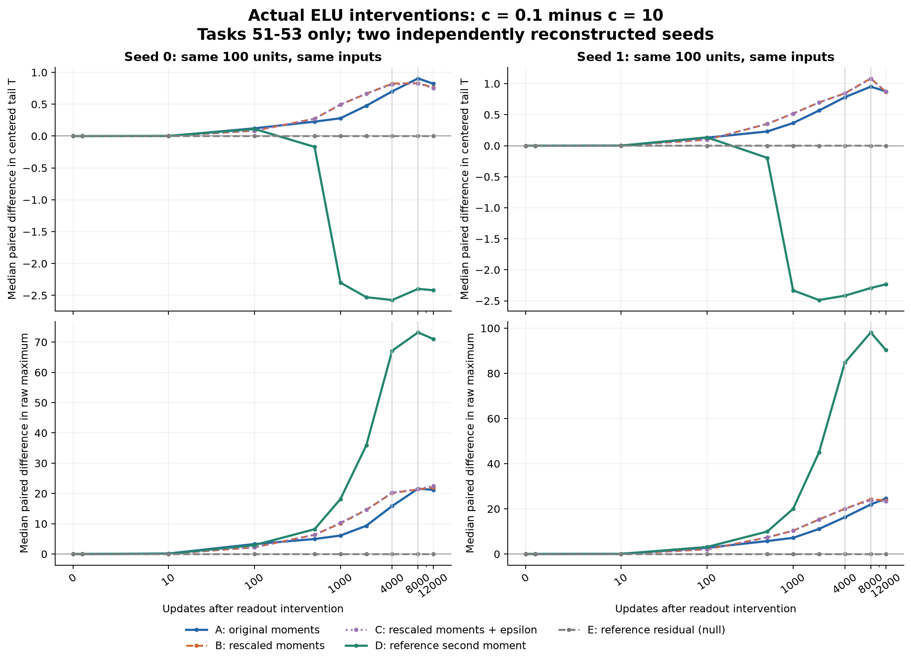

# 実ELUの機構対照：集計値

これは登録したtask51–53の短期介入であり、元のtask151–200の効果の同定ではない。
各値は同じ100unitの T(c=.1)−T(c=10) の中央値。T=(max−lower median)/sample SD。
A=元のmoment保持、B=hidden moment倍率整合、C=Bにepsilon倍率整合、D=Cの二次momentだけ基準からreplay、E=Cの残差を基準からreplay。

| seed | task | A | B | C | D | E | B/A | D/C |
|---:|---:|---:|---:|---:|---:|---:|---:|---:|
| 0 | 51 | 0.701726 | 0.824002 | 0.810375 | -2.57316 | 4.06839e-09 | 1.17425 | -3.17527 |
| 0 | 52 | 0.905155 | 0.831392 | 0.824719 | -2.39827 | 2.56964e-08 | 0.918508 | -2.90799 |
| 0 | 53 | 0.822212 | 0.763007 | 0.754349 | -2.41891 | -2.02627e-07 | 0.927993 | -3.20662 |
| 1 | 51 | 0.781217 | 0.844006 | 0.844065 | -2.41652 | 3.8616e-10 | 1.08037 | -2.86296 |
| 1 | 52 | 0.95163 | 1.08431 | 1.07848 | -2.29264 | -1.47742e-07 | 1.13942 | -2.1258 |
| 1 | 53 | 0.875598 | 0.867772 | 0.872556 | -2.2337 | 3.88488e-06 | 0.991062 | -2.55995 |

比は登録通り、分母の絶対値が.05より大きいときだけ表示。比を媒介因果の寄与率とは扱わない。

元データ・精度監査はreal_s*_provenance.json、real_s*_source_comparison.json、real_s*_null_checks.csv。
Eの一致は理論で決まる検算条件。浮動小数点での一致精度と実系の機構の発見を区別する。

## Residual replayの全記録時点での最大数値差

- seed0: hidden parameter 1.36179, T 1.56915, raw top 44.31, output bias 0.
- seed1: hidden parameter 0.916881, T 0.692405, raw top 27.2149, output bias 0.
