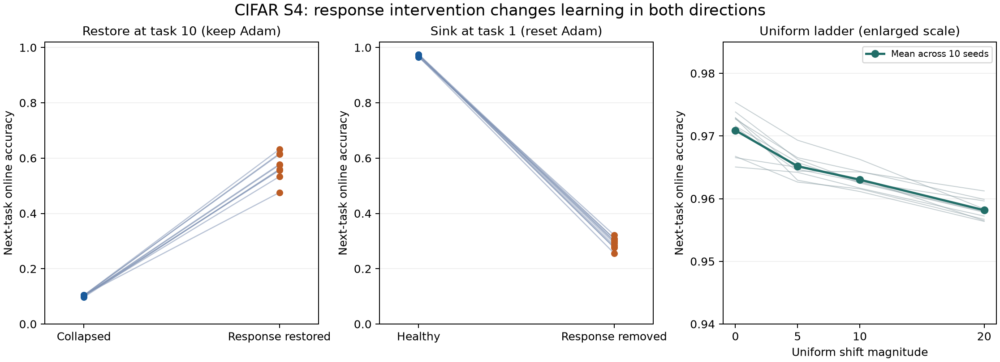

# S4 結果の読み（全腕完了後）

登録主判定は **RESPONSE_BOTH_WAYS**。P1は+46.740ポイント（97.5%区間42.877–50.604）、P2は+67.857ポイント（66.159–69.555）。適用条件も成立した。Codexの最大確率ラベルと追加予測はすべて一致し、rho1=0.572、rho2=0.781。確率はCodexのもの、Issaは内容を採用。

復元は自然対照10.22%から56.96%へ改善した。Adamもresetした副腕は92.82%で、自然な健康腕と同じ水準まで戻るという意味での完全回復を主P1が示したわけではない。沈降はresetした健康腕97.09%から29.23%へ低下した。第1層だけの沈降は96.71%にとどまる。

一様−5/−10/−20は96.52/96.30/95.82%。登録した標本平均の単調性は成立したが、自然な崩壊後の場の移植ほど大きく損なってはいない。これだけで応答の大きさ・分布・n_effのどれが媒介したかは分離できない。

最初の1 epochでは、同じ更新前状態でもB16とB1200の局所微分に最大0.001915の差があった。`first_epoch_comparison.csv` にseed・腕・層ごとの平均と差を記録した。旧R20とのonlineの最大差は0.290442で、比較表を保存した。いずれも同じR10内の主比較や自然再開のbit一致を置き換える合格条件にはしていない。

主結果の範囲は固定1200枚、ELU/std、固定した人工的応答場、1task=30,000更新。P1とP2の課題・optimizer履歴条件は異なる。自然なLoPの全媒介や恒久的救済とは言わない。独立監査なし。

S5の設計と予測は新規S4結果より前の`5705359`で採用済み。S4の結果を受けた半径・腕・期間・主窓・予測の変更はしない。

