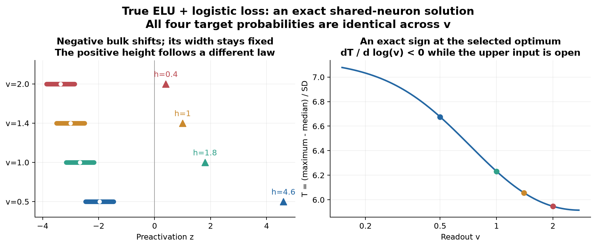

# 小vで上端が本体から離れる機構を、二群logisticで解く

2026-09-29。今回は、最小モデルの中では、上端が伸びる符号を未知の相関項なしで閉じた。**正側の線形応答と負側の指数応答は、同じ予測を実現するために必要な前活性の変化が違う。負側の幅が残ると、正側の高さの変化が一様な分布拡大にならず、上端の突出になる。**

この説明を、(i) 正確なELUの損失が選ぶ有限最適点、(ii) 完全飽和近似で勾配法が選ぶ解、の二つで導いた。単に各入力のzを別々に動かす模型ではなく、一つの共有wと学習可能なhidden/outputバイアスで実現する。数式から予測した後に数値を確認した。

**元のRL-MNISTで同じ機構が支配的だと確定したわけではない。** 実系では開く入力が大量に入れ替わり、倍率間の予測確率も異なる。最小問題の解と、現物への適用条件を分ける。

## 1. 正確なELUで、損失から解を選ぶ

出力を \(f(x)=c+v\operatorname{ELU}(w_1x_1+rx_2+b)\)、v>0とする。開いた稀な入力をx_A=(d,0)、閉じた本体をx_B=(0,u)、u=−1,0,1とする。本体の条件付き質量は1/4,1/2,1/4、稀な入力の質量はp<1/3。本体の中心はb、幅はσ_B=|r|/√2、正の上端はh=d w₁+bである。

各入力の条件付きラベル確率qを固定し、通常のbinary logistic期待損失を最小化する。有限の解を明確にするため0<q<1とする。目標logit ℓ=log(q/(1−q))をすべて実現できれば、cross entropyの下限を達成する。

ここでtargetは、幅r₀≠0を持つ一つの旧真ELU状態から生成して固定する（具体値は§3）。任意の3個の本体targetを許すわけではない。この構成が、以下のK>0と共有負枝への整合性を保証する。

負側では、

\[
f_B(u)=(c-v)+ve^b e^{ru}=\beta+K e^{ru}.
\]

異なる3個の本体logit \(\ell_-,\ell_0,\ell_+\) が、

\[
\beta=\frac{\ell_+\ell_- -\ell_0^2}{\ell_++\ell_- -2\ell_0},\qquad
K=\ell_0-\beta,\qquad
r=\log\frac{\ell_+-\beta}{K}
\]

を決める。従ってvを変えても、**rは同じで、bだけが−log vに沿って動く**。

正側では \(f_A=c+vh=\beta+v(h+1)\)。H=ℓ_A−βを固定すると、損失を最小にする解は

\[
\boxed{c^*=\beta+v,\quad b^*=\log(K/v),\quad r^*=r_0,\quad
h^*=H/v-1,\quad w_1^*=(h^*-b^*)/d.}
\]

これは「同じ出力を保つと仮定した」だけではない。この共有パラメータで全targetを厳密に達成できるためglobal minimumであり、r₀≠0なら別枝を含む他のexact-fit解も除外できる。詳細な一意性の証明は[理論ノート](../../analysis/two_group_logistic_0929/theory.md)。最適点のJacobianはfull rankで、Hessianも正定値。一方、非線形パラメータでの学習が任意の初期値から必ずそこへ行く、という大域収束定理ではない。全点が正枝の領域には別の非global停留点があり得る。

## 2. ここから上端の突出の符号が出る

全体のmedianはbである。上端と本体中心の距離をD=h−bとすると、

\[
\frac{dD}{d\log v}=-(h+1)+1=-h<0.
\]

つまり、vを小さくすると負側の本体も上へ動くが、**開いた上端の方が速く動き、距離が広がる**。rは変わらないので、本体の幅は広がらない。

混合分布の幅sと規格化上端Tは、

\[
s^2=(1-p)\sigma_B^2+p(1-p)D^2,\qquad T=D/s.
\]

したがって、

\[
\boxed{\frac{dT}{d\log v}
=-h\frac{(1-p)\sigma_B^2}{s^3}<0.}
\]

**「小vでTが上がる」が、既知の正の量だけから決まる。** 未知のQや共分散に符号の判断を残していない。必要なのは、h>0、本体が負側、σ_B>0、同じ固定targetを実現する枝である。Tが大きくなるにつれて全体のsも増えるが、式はその効果を含めたうえで符号を決めている。

本体幅が0の二点分布ならT=1/√(p(1−p))で一定になる。本体に幅があることは、この機構では必要である。また、全入力を一律1/v倍する対照もT一定になる。

## 3. 数式から出した数値を独立に検算した

d=4,p=.02、元のv₀=1.4、h₀=1,b₀=−3,r₀=.5,c₀=0とし、その元の真ELU出力から4個のtarget確率を固定した。vだけを変更する。許容区間は \(v_0e^{b_0+r_0}<v<v_0(h_0+1)\)、約.115<v<2.8。この区間は、全bodyが負・上端が正である条件から決まる。

| v | 理論の上端h | 本体中心b | 本体SD | 規格化上端T |
|---:|---:|---:|---:|---:|
| .5 | 4.6000 | −1.9704 | .3536 | 6.6759 |
| 1 | 1.8000 | −2.6635 | .3536 | 6.2319 |
| 1.4 | 1.0000 | −3.0000 | .3536 | 6.0571 |
| 2 | .4000 | −3.3567 | .3536 | 5.9465 |

同じ元のパラメータから独立に4本のlogit方程式を数値で解いた。全腕が1–7評価で解け、閉形式とのparameter差は最大1.91×10⁻¹⁴、logit差は最大4.44×10⁻¹⁶。Tの符号式と中央差分は最大1.95×10⁻¹¹で一致した。Hessianの最小固有値は約1.8×10⁻⁶で正、独立autogradとのHessian差は2.8×10⁻¹⁷以下だった。

これは4点の解の検算であり、MNISTの値に係数を合わせた結果ではない。数値root solverの成功を、Adamや勾配流の大域収束証明として扱わない。出所は[exact_elu_endpoints.csv](exact_elu_endpoints.csv)、[検算](exact_elu_checks.json)、[targetと初期値](exact_elu_provenance.json)。



## 4. 飽和近似では、別の形で「学習がその解を選ぶ」まで解ける

本体の出力を厳密に−1とし、body targetを全部q_B、上端targetをq_A>q_Bにする。この別モデルではbodyの幅rは損失から見えず、最適点は非一意になる。しかし共有パラメータの勾配流を直接書くと、

\[
\dot r=0,\qquad \dot w_1=d\dot b,
\quad b=b_0+\frac{h-h_0}{1+d^2}.
\]

本体幅を作る成分が初期値のまま残ることを、更新則から導ける。有限targetなら

\[
h^*=\frac{\operatorname{logit}q_A-\operatorname{logit}q_B}{v}-1,
\qquad
\frac{d(h^*-b^*)}{dv}
=-\frac{d^2}{1+d^2}\frac{\operatorname{logit}q_A-\operatorname{logit}q_B}{v^2}<0.
\]

従って、こちらでもTの符号が閉じる。前回の「固定gateなら全wをaffine補償してTを一定にできる」という対称性とは矛盾しない。**その補償解は存在するが、勾配法は損失から見えない成分を勝手に再尺度化せず、初期値を保持する。解の選択則が抜けていた。**

共通の学習済み平衡からvだけを上下させた場合、hがそれぞれ上・下へ新しいh*まで単調に動くことも、閉じた2変数の運動方程式から証明した。全共有parameterの数値積分と独立な2変数積分はhについて最大1.70×10⁻⁹、最終点は閉形式と最大7.20×10⁻¹⁴で一致した。

ただし、**同じ有限時刻の腕間の高さ順序まで普遍ではない**。小vでは到達点が高い一方、緩和も遅い。実行した4gainの緩和率を式で先に計算し、その50倍の時間で検算した。4,000回の更新が全腕で同じ到達度を意味するとはしていない。[flow_endpoints.csv](flow_endpoints.csv)、[過渡と対照の図](mechanism.png)。

## 5. Adamへ移す際に、負側の小勾配を無視してはいけない

完全飽和・zero moments・ε=0では、g_w1=d g_bからAdamの正規化後はΔw₁=Δbとなり、rとw₁−bが保存される。係数はSGDのd²/(1+d²)からd/(d+1)へ変わるが、同じTの符号が出る。固定した16腕ではこの保存則と終点を確認した。

一方、同じq_Bを全bodyに要求する**正確なELU**ではrは保存されない。初期body中心−24でも、ε=0なら10⁻¹²程度の初回勾配から.001の更新が入った。ε=10⁻⁸を加えた深いbodyでは幅がほぼ残ったが、浅いbodyでは同じεでも大きく動いた。初期幅より増える腕もあり、「漏れはいつも幅を縮める」も誤りだった。

この負の対照を含む32腕を固定して検算した。§1の真ELUで幅が一定なのは**異なる3個のbody targetがrを決めるから**であり、ここで同じtargetを要求しても幅が残ると主張しているのではない。[Adamの結果と独立実装検算](adam_report.md)。

## 6. 実ELUとの接続：合う点と、まだ使えない仮定

前回保存した元RL-MNISTの2seed、task50→51/53を再学習せず調べた。初期z≤−8の同じbody入力を追うと、v倍率.1/10の**同じunitのbody SD比**の中央値は.94–1.03。一方、現在上端の比は3.69–7.73だった（両腕でmax>0の70–88unit。全100unitの上端の対応差も正）。**上端は変わるがbody幅は一律に1/v倍されない**という、本模型の必要な非対称性は実系にもある。

しかし、task53の小vでは現在openの約9割が初期openの外から来ていた。初期bodyの平均移動を除いた変形も、初期SDの.70–.79倍ある。実系のbodyは固定されたままではなく、稀な入力群も入れ替わる。さらに倍率によって予測確率・当てはめが異なるので、§1の固定targetを各腕が完全に実現している条件も置けない。

従って、今回特定したのは**最小logisticにおける、枝ごとの補償率の差とbody幅の保持による突出機構**。元の系の100倍のv変更に対する部分的な補償量、開集合の増減、p⁺の水準、課題間の継続的な動力学までは、この定理で説明済みにしない。[同じ入力を追った実系監査](actual_report.md)。

## 再現と出所

理論: [theory.md](../../analysis/two_group_logistic_0929/theory.md)。計算前の範囲と、別targetの真ELU補遺を追加した時点は[spec](../../specs/spec_two_group_logistic_0929.md)。図、CSV、チェックJSON、provenance、コードを保存した。真ELUの数値補遺は飽和近似の32腕を置き換えていない。

元のPython環境にnumpy/torch/matplotlibがあり、今回scipy1.18.1だけを/tmp/two_group_logistic_depsへ追加した。通常のscipy環境ではPYTHONPATH指定は不要。リポジトリrootから：

```bash
export OPENBLAS_NUM_THREADS=1 OMP_NUM_THREADS=1
export MPLCONFIGDIR=/tmp/two-group-mpl
export PYTHONPATH=/tmp/two_group_logistic_deps
PYTHON=/home/issan/Projects/claude/proj_004_drift/.venv/bin/python
# 一時依存先が無い場合のみ: "$PYTHON" -m pip install --target "$PYTHONPATH" --no-deps scipy==1.18.1
"$PYTHON" analysis/two_group_logistic_0929/flow_check.py
"$PYTHON" analysis/two_group_logistic_0929/exact_elu_check.py
"$PYTHON" analysis/two_group_logistic_0929/adam_check.py
"$PYTHON" analysis/two_group_logistic_0929/actual_body_audit.py
"$PYTHON" analysis/two_group_logistic_0929/plot.py
```

exact_elu_checkはCPUで完了した。実行時にtorchがCUDA初期化の警告を出したが、計算はCPU tensorのみで、全検算を通過している。

保存時にCSV改行をLFへ統一した。全フィールドの同一性を確認し、変換前の生CSVと実行ログは外部データ領域へ保存した。対応とSHA256は[backup_manifest.json](backup_manifest.json)。数値コードは実行時のSHA256と一致し、実系監査の6入力も保存時のSHA256と一致している。
